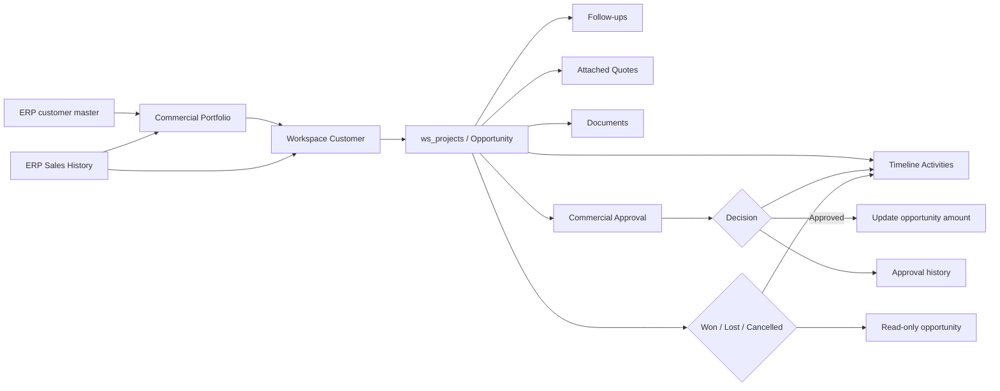
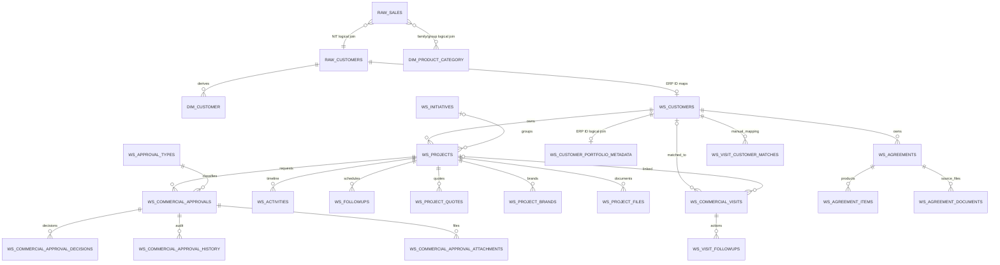
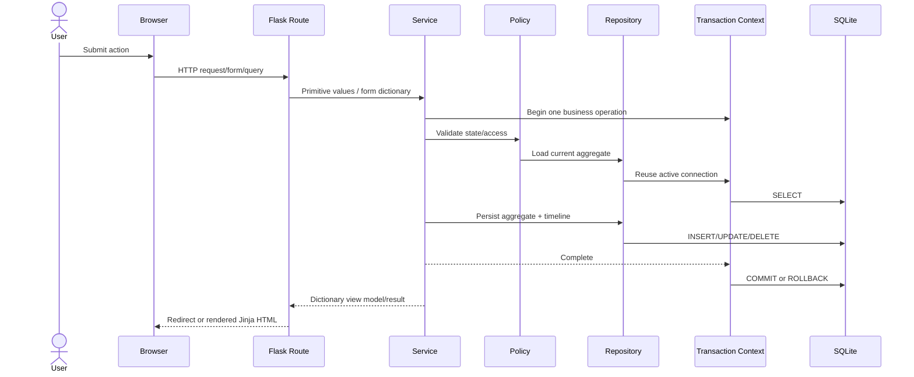
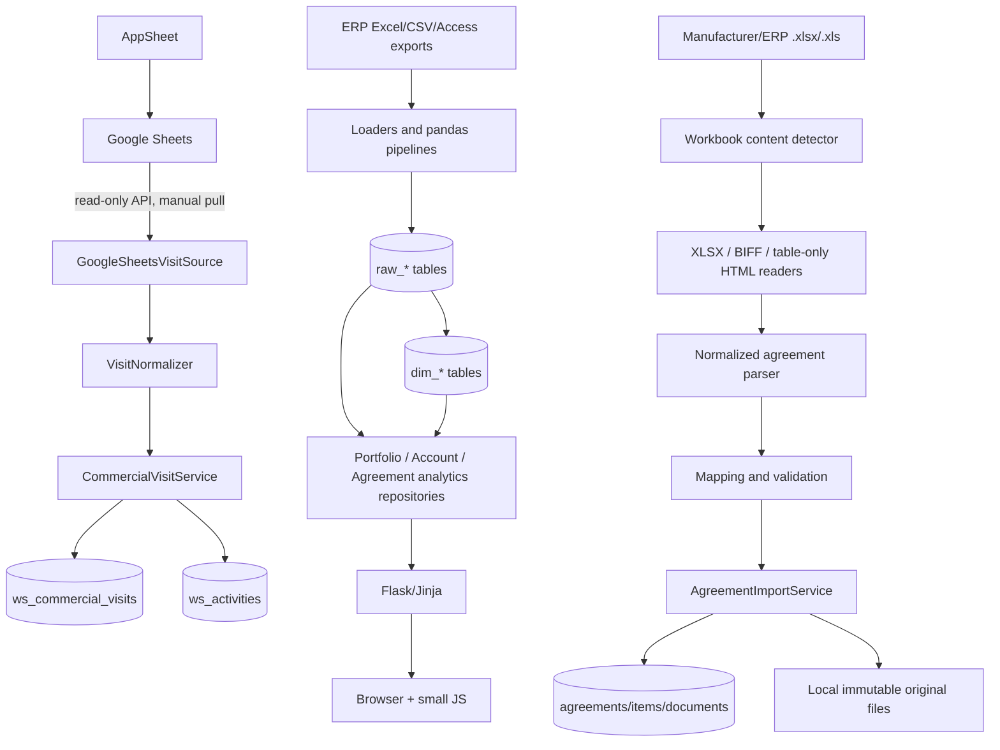
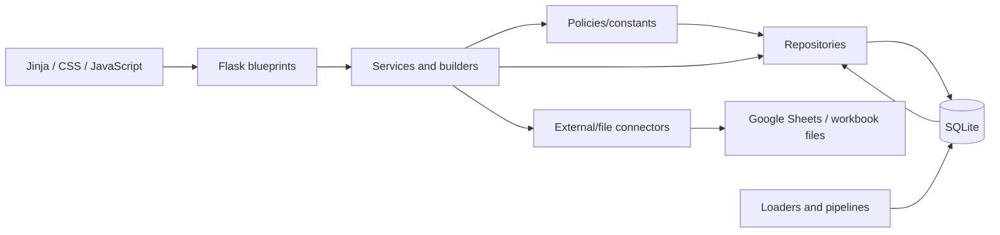

# Commercial Command Center — Current Architecture Assessment

**Sprint:** 1.1 — Current Architecture Inventory & Migration Assessment  
**Assessment date:** 2026-07-22  
**Scope:** repository and current SQLite database, read-only inspection  
**Purpose:** baseline for the migration from a project-centric CRM to an opportunity-centric CRM

> This document describes the implementation that exists, not an intended target architecture. Names such as “project” and “opportunity” are kept deliberately: the database and much of the code still use `project`, while the UI and business services increasingly call the same record an opportunity. No code, schema, or data was changed as part of this assessment.

## 1. Executive Summary

Commercial Command Center is a server-rendered Flask application that combines three related capabilities:

1. an ERP-derived commercial data mart containing customers, sales, and product classifications;
2. a transactional commercial workspace centered technically on `ws_projects`;
3. executive views for customer portfolios, strategic accounts, agreements, commercial visits, approvals, and initiatives.

The current day-to-day workflow starts from an ERP customer or from the opportunity list. A lightweight local customer workspace (`ws_customers`) links an ERP customer identifier to locally managed opportunities (`ws_projects`). An opportunity holds its status, owner, commercial amount, closure result, brands, quotes, follow-ups, files, activities, approvals, and optionally an initiative. Activities form the opportunity timeline. Closed opportunities are centrally treated as read-only. Separately, agreements and imported agreement products belong directly to a customer. AppSheet visits are pulled from Google Sheets, matched to local customers, and can be linked to an opportunity and published into its timeline.

Although the UI now consistently uses “Oportunidad”, the persistence aggregate, repository names, route paths, templates, and many service names remain project-centric. There is no separate Opportunity entity. The current Opportunity is `ws_projects`.

### Main entities

- **ERP customer:** `raw_customers` and derived `dim_customer`; authoritative source for the portfolio.
- **Workspace customer:** `ws_customers`; local anchor that maps an ERP customer to transactional modules.
- **Project / opportunity:** `ws_projects`; current transactional center.
- **Activity and follow-up:** `ws_activities`, `ws_followups`; timeline and next actions for an opportunity.
- **Quote:** `ws_project_quotes`; locally attached quote snapshot/revision.
- **Agreement and negotiated product:** `ws_agreements`, `ws_agreement_items`, `ws_agreement_documents`.
- **Commercial approval:** request, decision, history, and attachments tied to a project/opportunity.
- **Commercial visit:** imported AppSheet/Google Sheets record, customer matched and optionally opportunity linked.
- **Initiative:** portfolio-level grouping of projects/opportunities.
- **ERP sales:** `raw_sales`; basis for sales history, portfolio KPIs, agreement analytics, and strategic-account analytics.

### Current architecture

The application is a modular monolith:

```text
Browser → Flask blueprint → service/policy/builder → repository → sqlite3 → commercial.db
                                      ↘ connector → file / Google Sheets
```

Views are rendered with Jinja templates and enhanced with small, framework-free JavaScript files. Repositories use explicit SQL and return dictionaries. Services orchestrate business operations and presentation view models. Policies centralize selected state-machine and access rules. A `ContextVar`-backed transaction abstraction lets service-owned transactions be reused by nested service calls; repositories obtain the active connection and do not commit.

### Strengths

- The customer has been established as the conceptual root and ERP customer data is used for the portfolio, including customers without projects.
- Write transactions have an explicit service-owned boundary and nested service operations reuse it.
- Opportunity read-only enforcement is centralized in `ProjectAccessPolicy` and applied to transactional mutation services.
- Status vocabularies for opportunities, agreements, approvals, follow-ups, and activity types are mostly centralized.
- Repositories isolate most SQL; services generally own validation, state transitions, and presentation orchestration.
- Approval and visit events are published into the canonical opportunity timeline.
- Agreement import normalizes `.xlsx`, BIFF `.xls`, and ERP HTML-disguised-as-`.xls` before parsing.
- The migration system has an explicit ordered manifest, a ledger, transactionality, foreign-key enablement, and integrity warnings.
- The test suite covers the major recent modules and transaction/read-only behavior.

### Current limitations

- The domain vocabulary is split: “project” is still the technical aggregate while “opportunity” is the product language.
- ERP data and workspace data live in one SQLite database but have different lifecycle and integrity characteristics.
- No ORM models exist; schemas are duplicated between migration SQL, repository assumptions, schema registries, and legacy scripts.
- A single 1,610-line workspace route module contains every workspace endpoint and some request-level decision logic.
- Several repositories are very large and embed report construction as complex SQL.
- Some presentation/business calculations exist in builders and services with overlapping concepts (health/status/priorities).
- Authentication and authorization are not implemented in the active application. “Current user”, advisor, and the sole approver are configuration defaults or hard-coded values.
- Data synchronization is manual; no scheduler, queue, retry worker, or webhook was found.
- The checked database currently has 98 orphaned `ws_agreement_items` rows.
- Legacy empty modules, stale scripts, duplicated legacy services, and references to removed modules remain.
- The application runs in debug mode when started directly and does not show a production application factory/configuration boundary.

## 2. Project Structure

### Root

| Path | Current purpose |
|---|---|
| `app.py` | Creates the Flask app, registers the active blueprints, and starts the development server. |
| `config.py` | Empty; no active configuration object. Runtime settings are read from Flask config or environment variables directly. |
| `pyproject.toml` | Minimal package metadata; Python 3.12+, setuptools package discovery. |
| `requirements.txt` | Pinned runtime/test dependencies. Includes Flask, pandas, Excel/HTML readers, Google clients, SQLAlchemy, Flask-Login, and pytest. Some are not used by active code. |
| `database/commercial.db` | Single operational and analytical SQLite database. |
| `database/migrations/` | Two retained legacy SQL migrations; the active manifest is Python-based in `app/database/migrations.py`. |
| `uploads/` | Local project files, persistent agreement documents, and staged agreement imports. |
| `data/` | Raw/inbox/processed/archive data landing areas for file-based ingestion. |
| `sample_data/` | Development/sample inputs. |

### Application package

| Path | Current purpose |
|---|---|
| `app/database/` | SQLite connection, read/write helpers, transaction ownership, schema-name registry, and the consolidated migration manifest. |
| `app/loaders/` | File loader for incremental `raw_sales` ingestion and inbox archival. |
| `app/pipelines/` | pandas transformations from raw ERP extracts to customer/activity/product dimensions. |
| `app/sources/` | Generic Excel input adapter; AppSheet and CSV modules are empty placeholders. |
| `app/routes/` | Active Flask blueprints plus empty legacy route modules. `workspace.py` contains almost all product routes. |
| `app/services/` | Legacy service namespace. Only purchase history is active; a second, older `InitiativeService` remains. |
| `app/models/` | Empty package. There are no SQLAlchemy mapped models. |
| `app/templates/` | Jinja templates. `base.html` supplies the left navigation and Tabler-based shell; `workspace/` contains functional module views. |
| `app/static/css/` | Global workspace styles and module-specific portfolio, navigation, and strategic-account styles. |
| `app/static/js/` | Small progressive-enhancement scripts for navigation, customer filters/lookup, approvals, and strategic-account charts/interactions. No JS framework. |
| `app/workspace/constants/` | Central status and activity vocabularies. |
| `app/workspace/policies/` | Approval transitions and deterministic customer portfolio status rules. |
| `app/workspace/repositories/` | Explicit SQLite persistence/query layer for workspace aggregates and dashboards. |
| `app/workspace/services/` | Business operations, orchestration, validation, transactions, and presentation view models. |
| `app/workspace/builders/` | Customer dashboard/view-model builders for KPIs, priorities, projects, insights, and tags. |
| `app/workspace/connectors/` | Agreement workbook readers/parsers and the Google Sheets visit adapter. |
| `app/workspace/models/` | Empty package; no mapped domain/ORM models. |

### Operational support

| Path | Current purpose |
|---|---|
| `scripts/loaders/` | CLI entry points for raw customer segment and sales loads. |
| `scripts/pipelines/` | CLI entry points for the dimension pipelines. |
| `scripts/workspace/` | Current migration/bootstrap, diagnostics, cleanup, Google visit sync/rebuild, and older manual smoke scripts. |
| `scripts/*.py` | Access/Excel inspection and legacy import utilities, some with machine-specific paths. |
| `tests/` | pytest coverage for migrations, transactions, opportunity policies/filters, agreements, approvals, visits, customer portfolio, navigation, and dashboards. |
| `docs/` | Product, architecture, migration, engineering, ADR, and backlog documentation. Some older documents do not fully match the live schema. |

## 3. Database Model

### Database characteristics

- Engine: SQLite, one file at `database/commercial.db`.
- Access: Python `sqlite3`, rows exposed as dictionaries; pandas is used for bulk analytical reads/writes.
- Foreign keys: enabled and verified on every connection. The migration runner fails if it cannot enable them.
- Transactions: write operations are owned by service methods; nested calls reuse one connection. Repository calls outside a service receive a read transaction for backward compatibility.
- Migration version: explicit manifest 1–17 recorded in `schema_migrations`.
- Live inventory inspected on 2026-07-22: 33 application tables; `raw_sales` covers 2023-01-01 through 2026-06-30.
- Integrity: `PRAGMA foreign_key_check` reports 98 orphaned `ws_agreement_items` rows referencing absent agreements. The migration runner reports these as warnings; it does not repair them.

SQLite stores dates, timestamps, decimal snapshots, and some monetary values as `TEXT` in multiple workspace tables. Exact decimal approval fields were added as text snapshots to avoid binary floating-point loss, but older parallel `REAL` fields remain.

### Analytical and source tables

These tables are loaded/rebuilt from ERP extracts and are not relationally connected with foreign keys.

#### `raw_customers`

- **Purpose:** unmodified/normalized ERP customer master landing table; portfolio source of truth.
- **Primary key:** none.
- **Columns:** `nit`, `dv`, `razonsocial`, `escliente`, `cliente_credito`, `direccion1`, `ciudad`, `telefono1`, `movil`, `email`, `emailfe`, `vendedor`, `cupocreditocc`, `plazopagocc`, `idciiu`, `ID` (all `TEXT`).
- **Relationships:** joined by customer identifiers (`nit`/`ID`) in queries, not enforced.
- **Indexes:** none.

#### `raw_sales`

- **Purpose:** ERP sales-line fact landing table; supplies all real revenue, purchase recency, product, quote-adjacent, and agreement-usage analytics.
- **Primary key:** none; `sales_line_key` is a generated deduplication key but is not constrained.
- **Columns:** customer/document fields `nit`, `razonsocial`, `prefijo`, `numero`, `fecha`, `sucursal`, `idconvenio`, `ordencompra`; product fields `idproducto`, `nombreproducto`, `prefijo_1`, `sufijo`, `idfam1`, `idfam2`, `idunidad`, `idbodega`; numeric fields `cantidad`, `precio`, `preciousd`, `neto`, `valorbruto`, `descuento`, `vdescuento`, `costo`; `id`, `sales_line_key`.
- **Relationships:** logical joins to `raw_customers`/`dim_customer` by NIT and product dimensions by family/group IDs.
- **Indexes:** none. This is a significant performance concern at the inspected 305,598 rows.

#### `raw_customer_segments`

- **Purpose:** raw commercial activity/classification source.
- **Primary key:** none.
- **Columns:** `ID Actividad`, `actividad`, `CLASIFICACION`, `GRUPO`, `Clasificacion2`, `Grupo2`.
- **Relationships/indexes:** none.

#### `raw_product_classification`

- **Purpose:** raw hierarchical product classification source.
- **Primary key:** none.
- **Columns:** `Familia`, `Grupo`, `Subgrupo`, `Denominación`.
- **Relationships/indexes:** none.

#### `dim_customer`

- **Purpose:** site-level customer dimension created by `CustomerDimensionPipeline`.
- **Primary key:** none; `customer_site_id` is generated but unconstrained.
- **Columns:** `customer_site_id`, `customer_id`, `customer_name`, `address`, `city`, `seller`, `has_credit`, `credit_limit`, `payment_terms`, `activity_id_source`, `activity_name`, `classification_name`, `commercial_group_name`.
- **Relationships:** logical joins to `ws_customers.erp_customer_id`, `raw_sales.nit`, and activity dimension.
- **Indexes:** none.

#### `dim_customer_activity`

- **Purpose:** normalized ERP customer activity/classification dimension.
- **Primary key:** none.
- **Columns:** `activity_id`, `activity_name`, `classification_id`, `classification_name`, `commercial_group_id`, `commercial_group_name`.
- **Relationships/indexes:** logical join from `dim_customer.activity_id_source`; no constraints or indexes.

#### `dim_product`

- **Purpose:** lightly normalized copy of the raw product hierarchy.
- **Primary key:** none.
- **Columns:** `familia`, `grupo`, `subgrupo`, `denominación`.
- **Relationships/indexes:** none. It overlaps with `dim_product_category` and appears obsolete for active product analytics.

#### `dim_product_category`

- **Purpose:** family/group product dimension used by strategic-account and agreement analytics.
- **Primary key:** none.
- **Columns:** `family_id`, `family_name`, `group_id`, `group_name`.
- **Relationships:** logical joins to `raw_sales.idfam1/idfam2`.
- **Indexes:** none.

### Migration metadata

#### `schema_migrations`

- **Purpose:** active migration ledger.
- **Primary key:** `version`.
- **Columns:** `version INTEGER`, `name TEXT NOT NULL UNIQUE`, `applied_at TEXT NOT NULL`.
- **Relationships:** none.
- **Indexes:** automatic unique index on `name`.

### Workspace customer and portfolio

#### `ws_customers`

- **Purpose:** local transactional customer anchor and ERP identity bridge.
- **Primary key:** `id`.
- **Columns:** `id`, `name NOT NULL`, `erp_customer_id`, `created_at`, `updated_at`.
- **Relationships:** parent of projects, agreements, visits, and manual visit matches.
- **Foreign keys:** none outbound.
- **Indexes:** partial/declared unique `idx_ws_customers_unique_erp_customer` on `erp_customer_id`.

#### `ws_customer_portfolio_metadata`

- **Purpose:** business-managed classifications/assignments not inferred from ERP transactions.
- **Primary key:** `erp_customer_id`.
- **Columns:** `erp_customer_id`, `is_strategic`, legacy `branch`, `advisor`, `created_at`, `updated_at`, current `office`.
- **Relationships:** logical join to ERP customer ID; intentionally no FK because the master set is rebuilt externally.
- **Indexes:** `office`, `advisor`, and legacy `branch`.
- **Observation:** `branch` and `office` coexist; current UI semantics use `office` as responsible office and ERP `city` separately.

### Current opportunity aggregate

#### `ws_projects`

- **Purpose:** the current opportunity record despite its project name.
- **Primary key:** `id`.
- **Columns:** identity/ownership `customer_id`, `name`, `sales_rep`, `customer_site_id`, `initiative_id`; lifecycle `status`, `created_at`, `updated_at`, `closed_at`; commercial context `objective`, `proposed_solution`, `current_blocker`, `commercial_amount TEXT`, `commercial_currency`; closure data `close_reason`, `close_comments`, `competitor_company`, `competitor_type`, `competitor_brand`, `won_amount`, `order_number`, `customer_po`, `result_changer`.
- **Foreign keys:** `customer_id → ws_customers.id ON DELETE RESTRICT`.
- **Relationships:** parent of activities, follow-ups, brands, files, quotes, approvals; optional target of visits. `initiative_id` logically targets `ws_initiatives.id` but has no FK.
- **Indexes:** `idx_ws_projects_initiative_id` only.
- **Centrality:** principal transactional aggregate and migration focal point.

#### `ws_activities`

- **Purpose:** canonical opportunity timeline, including manual interactions, state changes, approvals, visits, and closure events.
- **Primary key:** `id`.
- **Columns:** `project_id`, `activity_type`, `title`, `details`, `created_by`, `occurred_at`, `created_at`.
- **Foreign key:** `project_id → ws_projects.id ON DELETE CASCADE`.
- **Indexes:** none.

#### `ws_followups`

- **Purpose:** opportunity next actions.
- **Primary key:** `id`.
- **Columns:** `project_id`, `due_date`, `description`, `status`, `completed_at`, `created_by`, `created_at`.
- **Foreign key:** `project_id → ws_projects.id ON DELETE CASCADE`.
- **Indexes:** unique pending-action index on (`project_id`, `due_date`, `description`).

#### `ws_project_brands`

- **Purpose:** many-valued manufacturer/brand tags for an opportunity.
- **Primary key:** `id`.
- **Columns:** `project_id`, `brand`, `created_at`.
- **Foreign key:** `project_id → ws_projects.id ON DELETE CASCADE`.
- **Indexes:** unique (`project_id`, `brand`).

#### `ws_project_files`

- **Purpose:** metadata for locally stored opportunity documents.
- **Primary key:** `id`.
- **Columns:** `project_id`, `category`, `original_name`, `stored_name`, `mime_type`, `file_size`, `uploaded_by`, `created_at`.
- **Foreign key:** `project_id → ws_projects.id ON DELETE CASCADE`.
- **Indexes:** none; `stored_name` is not unique at database level.

#### `ws_project_quotes`

- **Purpose:** quotes attached to an opportunity, including currency normalization and revisions.
- **Primary key:** `id`.
- **Columns:** `project_id`, `quote_number`, `branch`, `prefix`, `quote_date`, `amount`, `quote_status`, `erp_user`, `created_at`, `currency_code`, `exchange_rate`, `normalized_amount`, `revision`, `exchange_rate_type`.
- **Foreign key:** `project_id → ws_projects.id ON DELETE CASCADE`.
- **Indexes:** project, currency, and unique (`project_id`, `prefix`, `quote_number`).

### Initiatives

#### `ws_initiatives`

- **Purpose:** strategic grouping above opportunities.
- **Primary key:** `id`.
- **Columns:** `name`, `status`, `objective`, `description`, `strategy`, `partner`, `owner`, `start_date`, `expected_end_date`, `created_at`, `updated_at`, `closed_at`.
- **Relationships:** logical parent of `ws_projects.initiative_id`; physical parent of event/decision/learning tables.
- **Indexes:** status and owner.

#### `ws_initiative_events`

- **Purpose:** initiative-level history.
- **Primary key:** `id`.
- **Columns:** `initiative_id`, `event_type`, `title`, `details`, `occurred_at`, `created_at`, `created_by`.
- **Foreign key:** initiative, cascade delete.
- **Index:** (`initiative_id`, `occurred_at`).

#### `ws_initiative_decisions`

- **Purpose:** structured strategic decisions for an initiative.
- **Primary key:** `id`.
- **Columns:** `initiative_id`, `decision`, `reason`, `decided_by`, `decision_date`, `created_at`.
- **Foreign key:** initiative, cascade delete.
- **Index:** (`initiative_id`, `decision_date`).

#### `ws_initiative_learnings`

- **Purpose:** categorized initiative learnings.
- **Primary key:** `id`.
- **Columns:** `initiative_id`, `category`, `title`, `details`, `created_at`, `created_by`.
- **Foreign key:** initiative, cascade delete.
- **Index:** (`initiative_id`, `category`).
- **Observation:** current database has no decision or learning rows and active UI/service operations focus on initiative CRUD and opportunity assignment.

### Agreements

#### `ws_agreements`

- **Purpose:** customer-level commercial agreement header.
- **Primary key:** `id`.
- **Columns:** `customer_id`, `agreement_number`, `name`, `status`, `agreement_type`, `supplier`, `annual_target`, `currency`, `start_date`, `end_date`, `renewal_date`, `has_consignment`, `notes`, timestamps.
- **Foreign key:** `customer_id → ws_customers.id ON DELETE CASCADE`.
- **Indexes:** customer and status.

#### `ws_agreement_items`

- **Purpose:** negotiated product rows imported from manufacturer workbooks.
- **Primary key:** `id`.
- **Columns:** agreement/source `agreement_id`, `source_file_name`, `source_row_number`; legacy identity/price fields `part_number`, `skf_reference`, `list_price_usd`, `agreement_price_usd`, `suggested_price_usd`; normalized fields `internal_sku`, `manufacturer_part_number`, `normalized_reference`, `description`, `product_line`, `spc`, `unit_of_measure`, `item_notes`; generic and exact prices `negotiated_price`, `price_currency`, `list_price_decimal`, `negotiated_price_decimal`, `suggested_price_decimal`; optional item dates `product_start_date`, `product_end_date`; timestamps.
- **Foreign key:** `agreement_id → ws_agreements.id ON DELETE CASCADE`.
- **Indexes:** agreement, part number, SKF reference, normalized reference, and unique (`agreement_id`, `part_number`, `skf_reference`).
- **Integrity note:** 98 current rows violate this FK. Item-level currency/dates remain nullable and effective business values inherit from the agreement in service/presentation logic.

#### `ws_agreement_documents`

- **Purpose:** immutable original agreement upload metadata.
- **Primary key:** `id`.
- **Columns:** `agreement_id`, `original_name`, unique `stored_name`, `mime_type`, `file_size`, `file_extension`, `created_at`.
- **Foreign key:** agreement, cascade delete.
- **Index:** agreement plus unique stored name.

### Commercial approvals

#### `ws_approval_types`

- **Purpose:** approval category catalog; currently seeded for commercial discount.
- **Primary key:** `id`.
- **Columns:** unique `code`, `name`, `is_active`, `created_at`.
- **Relationships:** parent of approval requests.

#### `ws_commercial_approvals`

- **Purpose:** commercial discount request and immutable/request-time context snapshot.
- **Primary key:** `id`.
- **Columns:** project/type/status; customer/opportunity/manufacturer/branch/advisor/product context; quantity/competition; opportunity value/probability/stage; list/requested price and discount; margin/revenue/currency; reason/justification/notes; creator/submission/update/create/delete timestamps; ERP price provenance fields `product_reference`, `erp_price_source`, `erp_price_retrieved_at`.
- **Foreign keys:** project and approval type, both `ON DELETE RESTRICT`.
- **Index:** (`project_id`, `status`).

#### `ws_commercial_approval_decisions`

- **Purpose:** append-only approver decisions and exact monetary outcome snapshot.
- **Primary key:** `id`.
- **Columns:** decision identity/comment/expiry plus legacy `approved_discount REAL`; exact text fields for requested/approved discount, list/approved unit price, quantity, total, currency, comments, actor, decision time.
- **Foreign key:** approval, restrict delete.
- **Index:** (`approval_id`, `decided_at`).

#### `ws_commercial_approval_history`

- **Purpose:** status/audit history of a request.
- **Primary key:** `id`.
- **Columns:** `approval_id`, `event_type`, `from_status`, `to_status`, `actor`, `comments`, JSON `event_data`, `created_at`.
- **Foreign key:** approval, restrict delete.
- **Index:** (`approval_id`, `created_at`).

#### `ws_commercial_approval_attachments`

- **Purpose:** attachment metadata for an approval.
- **Primary key:** `id`.
- **Columns:** approval, original/stored names, MIME, size, uploader, timestamp.
- **Foreign key:** approval, restrict delete.
- **Index:** unique stored name only.
- **Observation:** schema and table exist, but no active repository/service/route implements attachment behavior.

### Commercial visits

#### `ws_commercial_visits`

- **Purpose:** normalized, auditable mirror of AppSheet visits read from Google Sheets.
- **Primary key:** `id`.
- **Columns:** source identity/hash/payload/timestamps; normalized visit date/type/status; advisor; source and matched customer identity; contact; visit narrative/need/risk/competitor; action/commitment; opportunity-generation flag; attachment reference; optional project link; duplicate/quality flags; active flag.
- **Foreign keys:** `customer_id → ws_customers.id ON DELETE SET NULL`; `project_id → ws_projects.id ON DELETE SET NULL`.
- **Indexes:** customer/date, match status, project, and unique (`source_system`, `source_visit_id`).

#### `ws_visit_customer_matches`

- **Purpose:** manual source-customer-key to workspace-customer mapping.
- **Primary key:** `source_customer_key`.
- **Columns:** key, `customer_id`, `created_at`.
- **Foreign key:** customer, cascade delete.
- **Indexes:** primary key only.

#### `ws_visit_followups`

- **Purpose:** imported/upserted follow-up associated directly with a source visit.
- **Primary key:** `id`.
- **Columns:** visit, unique external key, description, owner, due date, status, updated timestamp.
- **Foreign key:** visit, cascade delete.
- **Index:** unique external key.
- **Observation:** this is separate from opportunity `ws_followups`.

#### `ws_visit_sync_runs`

- **Purpose:** synchronization audit and quality counters.
- **Primary key:** `id`.
- **Columns:** source, start/end/status, rows read, inserted/updated/unchanged/unmatched/duplicate/error counts, error summary.
- **Relationships/indexes:** none.

### Central, auxiliary, and obsolete-looking tables

- **Central:** `raw_customers`, `raw_sales`, `ws_customers`, `ws_projects`, `ws_activities`.
- **Major supporting aggregates:** agreements/items/documents, approvals/decisions/history, visits/sync/follow-ups, quotes, opportunity follow-ups/files/brands, initiatives.
- **Auxiliary/reference:** customer/product/activity dimensions, portfolio metadata, approval types, migration ledger, manual visit matches.
- **Potentially obsolete or transitional:** `dim_product` overlaps `dim_product_category`; `ws_customer_portfolio_metadata.branch` is superseded in current semantics by `office`; legacy price/date columns in agreement items coexist with newer normalized/exact fields. The code does not prove safe removal, so these are candidates only.
- **Declared but absent:** `app/database/schema.py` lists `raw_customer_activity`, `raw_crm`, `raw_quotes`, `fact_sales`, `fact_crm`, and `fact_quotes`, none of which exists in the inspected database.

## 4. SQLAlchemy Models

There are **no SQLAlchemy models** in the current implementation.

- `app/models/__init__.py` and `app/workspace/models/__init__.py` are empty.
- No declarative base, mapped class, session, or model relationship was found.
- `SQLAlchemy==2.0.51` is installed but unused by active persistence code.
- Domain records cross layers as `dict[str, Any]` values built from `sqlite3.Row`.
- Relationships and cascade behavior exist only in SQLite DDL and repository queries.

Accordingly, the model inventory is the database table inventory in Section 3 plus service-level view models. Any future engineer must not infer ORM semantics from the dependency or folder names.

## 5. Repository Layer

All active workspace repositories issue explicit SQL. Newer repositories use `connection_scope()`, which reuses a service-owned transaction. Three reporting repositories still call `get_connection()` directly and close their own read connection. Repositories do not intentionally own business transactions or call `commit()`.

| Repository | Responsibilities and notable queries | Dependencies |
|---|---|---|
| `ActivityRepository` | Create timeline events; list a project's timeline in reverse chronology. | `ws_activities`, transaction scope. |
| `AgreementAnalyticsRepository` | Load agreement/customer/items, prior agreement, matching sales history, and known product keys for comparison. | Agreements, items, customers, `raw_sales`, product category. |
| `AgreementDocumentRepository` | Insert and retrieve the stored document metadata for an agreement. | Agreement documents. |
| `AgreementItemRepository` | Bulk insert normalized import rows; legacy insert/list/replace operations; count agreement items. | Agreement items. |
| `AgreementRepository` | Active agreement lookup, create/read/list/update/expire/delete. | Agreements. |
| `CommercialApprovalRepository` | Approval type lookup; create/update/status; history/decision append and reads; project list, metrics, latest request. | Approval tables and project. |
| `CommercialVisitRepository` | Visit CRUD/upsert support, duplicate detection, matching, quality lists, visit follow-ups, sync audit, source rebuild, and project-event/link checks. | Visit tables and `ws_activities`. |
| `CustomerDetailRepository` | ERP summary/sites, customer projects, open pipeline totals, sales aggregates, and recent ERP sales documents. | `dim_customer`, `raw_sales`, projects, project quotes. Uses direct connections. |
| `CustomerLookupRepository` | Search ERP customer sites and fetch one/all sites for customer selection. | `dim_customer`. Uses direct connections. |
| `CustomerPortfolioRepository` | Server-side portfolio pagination/filtering/sorting, KPI aggregates, filter dimensions, metadata synchronization, assignment lookup, master customer lookup, and agreement product coverage. It constructs multiple CTEs across ERP and workspace data. | Raw/dim customers and sales; projects, activities, visits, follow-ups, quotes, agreements/items, metadata. It imports the portfolio status policy to reuse SQL predicates. |
| `CustomerRepository` | Workspace customer create/get/list/find-by-ERP-ID. | `ws_customers`. |
| `FollowupRepository` | Duplicate check, create/get/list/complete/reschedule, and due follow-up list with customer/project joins. | Follow-ups, projects, customers. |
| `InitiativeRepository` | Initiative CRUD, timeline events, related opportunity aggregation, assignments, and deletion. Also contains reads for decisions/learnings. | Initiative tables, projects/customers/quotes. At 467 lines, it is both persistence and reporting. |
| `ProjectBrandRepository` | Add/replace/list opportunity brands. | Project brands. |
| `ProjectFileRepository` | File metadata create/get/list/delete. | Project files. |
| `ProjectQuoteRepository` | Attach/replace the primary quote and list opportunity quotes. | Project quotes. |
| `ProjectRepository` | Create/get/list opportunities; list enriched overviews; amount reads/writes; owners; generic edits/status/blocker; initiative assignment; closure variants; delete. | Projects plus customers, activities, follow-ups, and quotes. At 649 lines, it is the largest repository. |
| `QuoteRepository` | Quote CRUD, amount/exchange-rate/status changes, revision creation, and detailed update. | Project quotes. |
| `StrategicAccountRepository` | Account header, primary agreement, real sales summary/monthly/families, activity metrics/recent activity, and opportunity pipeline. | ERP customer/sales/product dimensions and workspace account tables. Uses direct connections. |
| `WorkspaceDashboardRepository` | Pending follow-ups and recent projects for home. | Follow-ups, projects, customers. Uses direct connections. |

### Repository boundary observations

- Most repositories limit themselves to persistence and query composition.
- `CustomerPortfolioRepository` imports `CustomerPortfolioStatusPolicy` for SQL filter/sort expressions. This avoids duplicate status rules, but couples repository query construction to a business policy.
- Dashboard repositories necessarily return denormalized read models; this is reporting logic rather than aggregate CRUD.
- Repeated `get_*` method names and dictionary results provide no compile-time contract.
- `FollowupRepository` defines `get_followup` twice; the later definition shadows the earlier one.
- No repository commits were found. This matches the documented transaction ownership rule.

## 6. Service Layer

### Workspace services

| Service | Responsibility, business logic, and collaborators |
|---|---|
| `AgreementAnalyticsService` | Allocates sales to normalized negotiated references, calculates matched/never-purchased/lost products, coverage, monthly and family views, priorities, period comparisons, filters, and presentation formatting. Uses `AgreementAnalyticsRepository`. |
| `AgreementImportService` | Owns staged upload lifecycle, size/extension checks, content inspection, metadata prefill, preview state/token expiry, validation, atomic agreement replacement/import, immutable file copy, and cleanup. Uses workbook parser, validator, agreement/customer/item/document repositories, and a transaction. |
| `AgreementImportValidator` | Central agreement-header and column-mapping validation; converts prices to exact decimal strings, detects duplicates, and produces row warnings/errors and normalized rows. |
| `AgreementService` | Agreement CRUD and customer agreement page orchestration, status labels, analytics, and documents. Transactional for mutations. |
| `CommercialApprovalService` | Approval lifecycle and policy orchestration: enrich request context, validate prices/discount/reason, create/edit/submit/decide/cancel/expire, calculate approved unit/total values with `Decimal`, update opportunity amount atomically, append history/decision, and publish timeline events. It enforces the project write policy. The only approver is hard-coded as Ricardo Lugo. |
| `CommercialApprovalEventPublisher` | Six-line no-op extension hook; `publish()` currently returns `None`. It provides no integration today. |
| `CommercialVisitService` | Manual/configured sync and rebuild orchestration, normalization, customer matching, duplicate detection, idempotent insert/update, follow-up upsert, sync audit, optional opportunity linking, and timeline publication. Uses Google adapter, visit/customer/project repositories, normalizer, and timeline service. |
| `CustomerDetailService` | Builds the commercial profile from ERP account/site/sales data, projects, pipeline, agreements, agreement item count, KPIs, tags, insights, and commercial priorities. Uses several builders and services. |
| `CustomerPortfolioService` | Meaningful read orchestration rather than pass-through: validates query state, server pagination/sort/filter, computes display status, growth, days since purchase, next action, KPIs/chips, and resolves an ERP master customer into a local workspace customer transactionally. |
| `InitiativeService` | Initiative creation/list/detail/edit/delete plus opportunity assignment/removal; creates initiative events, validates statuses/fields, formats totals, and checks opportunity writability. It is very large (642 lines) and contains a duplicate `update_initiative` definition. |
| `OpportunityListService` / `OpportunityFilters` | Validates composable URL filters, pushes persistence-safe filters to the repository, calculates health/presentation, applies health filtering, and builds filter options. No pagination is implemented for this list. |
| `OpportunityTimelineService` | Converts approval and visit events into `ws_activities` entries with commercial titles/details and presentation metadata. It is the bridge from specialized histories to the canonical opportunity timeline. |
| `ProjectAccessPolicy` | Central read-only rule: `won`, `lost`, and `cancelled` opportunities reject mutation. It loads the project through `ProjectRepository`. |
| `ProjectClosureService` | Validates won/lost/cancelled closure details, updates the project, appends a closure timeline event, and returns the refreshed workspace atomically. |
| `ProjectFileService` | Validates and stores/deletes opportunity files and metadata with compensating filesystem cleanup; applies read-only policy. |
| `ProjectHealthService` | Computes list-level opportunity health from closed state, overdue follow-ups, and last activity; owns health filter options and timestamp parsing. |
| `ProjectWorkspaceService` | Main opportunity application service: create/start, status/blocker changes, follow-up lifecycle, activity creation, details, workspace assembly, project deletion, brands/quotes/files, and timeline. It coordinates most repositories and enforces allowed statuses/activity types/read-only access. At 787 lines it is the largest service. |
| `QuoteService` | Currency/exchange-rate normalization, display enrichment, quote reads and transactional updates/revisions; enforces opportunity writability. |
| `StrategicAccountService` | Builds the executive overview from real customer, sales, activity, opportunity, agreement, and agreement analytics. It owns trends, provisional health/engagement, KPI and chart view models, activity curation, and placeholders for not-yet-real metrics. |
| `VisitAttachmentResolver` | Placeholder that currently returns the source reference unchanged; no Google Drive download/resolve behavior exists. |
| `VisitNormalizer` | Defensive AppSheet row normalization, identifier/boolean/status/type mapping, stable row hash, source payload capture, quality warnings, and strict contractual Google date parsing (`MM/DD/YYYY`) for visit/registration dates. |
| `WorkspaceDashboardService` | Formats recent opportunities and pending follow-ups for the home dashboard. |

### Customer builders

- `CustomerProjectBuilder`: enriches customer projects with quote display data.
- `CustomerPriorityBuilder`: older priority calculation using customer/projects/pipeline/sales.
- `CommercialPriorityBuilder`: newer prioritized action list based on project status, blockers, quote state, and agreement expiry.
- `CustomerKPIBuilder`: customer detail KPI view model.
- `CustomerInsightBuilder`: deterministic textual insights from sales and pipeline; not AI.
- `CustomerTagBuilder`: deterministic account tags.

### Legacy services and pipelines

- `PurchaseHistoryService` is active at `/purchase-history`; it runs a hard-coded-style analytical query over `raw_sales` and returns a pandas DataFrame.
- `app/services/initiative_service.py` is an older duplicate of part of the workspace initiative service and is not imported by active routes.
- `customer_service.py` and `dashboard_service.py` are empty.
- `BasePipeline` defines extract/clean/validate/transform/load.
- Customer activity and customer dimension pipelines build `dim_customer_activity` and `dim_customer`; the latter also synchronizes portfolio metadata from the master.
- Product category pipeline builds `dim_product_category`; a separate product dimension pipeline builds the overlapping `dim_product`.
- `pipeline_manager.py` and `sales_pipeline.py` are empty. Raw sales loading is implemented as a loader rather than a pipeline.

### ERP, AppSheet, AI, and transaction interaction

- **ERP:** services read local snapshots in `raw_*`/`dim_*`; there is no active live ERP API. Approval list price is accepted from form data and stored with optional provenance fields; active code does not retrieve it from ERP.
- **AppSheet:** only via Google Sheets read API, pulled on demand or CLI. Normalization and persistence happen in `CommercialVisitService`.
- **AI:** no service, provider call, prompt, model, or OpenAI dependency is present. “Insights” are deterministic builders/placeholders.
- **Transactions:** `@transactional` wraps individual business operations. The `ContextVar` means nested service calls share the outer connection and do not create nested SQLite transactions.

## 7. Flask Blueprints

The active application registers four blueprints: `home`, `purchase_history`, `workspace`, and `customers_api`. Empty modules `crm.py`, `customers.py`, `dashboard.py`, `imports.py`, and `quotes.py` define no blueprint and are inactive.

### `home` blueprint

| Method/path | Purpose | Template/dependency |
|---|---|---|
| `GET /` | Workspace landing dashboard with pending follow-ups and recent projects. | `home.html`; `WorkspaceDashboardService`. |

### `purchase_history` blueprint

| Method/path | Purpose | Template/dependency |
|---|---|---|
| `GET /purchase-history` | Product purchase history for a customer/family/group. Current route passes fixed customer and category values. | `purchase_history.html`; `PurchaseHistoryService`. |

### `customers_api` blueprint

| Method/path | Purpose | Dependency |
|---|---|---|
| `GET /api/customers/search` | Customer/site autocomplete for opportunity creation. | `CustomerLookupRepository` directly. |

### `workspace` blueprint — opportunity and approval routes

| Method/path | Purpose | Main template/service |
|---|---|---|
| `GET /workspace/projects` | Filtered opportunity list. | `project_list.html`; `OpportunityListService`. |
| `GET /workspace/projects/<id>` | Opportunity workspace/detail and timeline. | `project_detail.html`; `ProjectWorkspaceService`. |
| `GET,POST /workspace/projects/new` | Create opportunity with customer/site, brands, quote, and follow-up inputs. | `new_project.html`; `ProjectWorkspaceService`. |
| `GET,POST /workspace/projects/<id>/edit` | Edit opportunity details. | `edit_project.html`; `ProjectWorkspaceService`. |
| `POST /workspace/projects/<id>/activity` | Add manual commercial activity. | `ProjectWorkspaceService`. |
| `POST /workspace/projects/<id>/status` | Change open status. | `ProjectWorkspaceService`. |
| `POST /workspace/projects/<id>/blocker` | Change blocker. | `ProjectWorkspaceService`. |
| `POST /workspace/followups/<id>/complete` | Complete follow-up. | `ProjectWorkspaceService`. |
| `POST /workspace/followups/<id>/reschedule` | Reschedule follow-up. | `ProjectWorkspaceService`. |
| `POST /workspace/projects/<id>/close-won` | Close won. | `ProjectClosureService`. |
| `POST /workspace/projects/<id>/close-lost` | Close lost. | `ProjectClosureService`. |
| `POST /workspace/projects/<id>/cancel` | Cancel. | `ProjectClosureService`. |
| `POST /workspace/projects/<id>/delete` | Delete opportunity. | `ProjectWorkspaceService`. |
| `POST /workspace/projects/<id>/files` | Upload file. | `ProjectFileService`. |
| `GET /workspace/files/<id>/download` | Download file. | `ProjectFileService`. |
| `POST /workspace/files/<id>/delete` | Delete file. | `ProjectFileService`. |
| `GET,POST /workspace/quotes/<id>/edit` | Edit/revise quote. The function has duplicate route decorators for the same path. | `edit_quote.html`; `QuoteService`. |
| `GET /workspace/projects/<id>/approvals` | Approval list and metrics for opportunity. | `commercial_approval_list.html`; `CommercialApprovalService`. |
| `GET,POST /workspace/projects/<id>/approvals/new` | Create draft request. | `commercial_approval_form.html`; approval service. |
| `GET,POST /workspace/approvals/<id>/edit` | Edit draft/returned request. | same form/service. |
| `GET /workspace/approvals/<id>` | Seller/approver detail. | `commercial_approval_detail.html`. |
| `POST /workspace/approvals/<id>/submit` | Submit and move to pending. | approval service. |
| `POST /workspace/approvals/<id>/decision` | Approve/return/reject; route supplies the hard-coded approver role/name. | approval service. |
| `POST /workspace/approvals/<id>/cancel` | Cancel request. | approval service. |
| `POST /workspace/approvals/<id>/expire` | Expire approval. | approval service. |

### `workspace` blueprint — customer, account, agreement, and visit routes

| Method/path | Purpose | Main template/service |
|---|---|---|
| `GET /workspace/customers` | Paginated Commercial Portfolio with URL filters/sort. | `customer_list.html`; `CustomerPortfolioService`. |
| `GET /workspace/customers/erp/<erp_id>` | Materialize/find local customer then redirect to workspace. | portfolio service. |
| `GET /workspace/customers/<id>` | Backward-compatible redirect to the strategic account workspace. | `CustomerRepository` directly. |
| `GET /workspace/strategic-accounts/<id>` | Executive overview dashboard. | `strategic_account_overview.html`; `StrategicAccountService`. |
| `GET /workspace/strategic-accounts/<id>/commercial-profile` | Detailed commercial profile. | `customer_detail.html`; `CustomerDetailService`. |
| `GET /workspace/strategic-accounts/<id>/activities` | Customer visit activity. | `customer_activities.html`; `CommercialVisitService`. |
| `GET /workspace/strategic-accounts/<id>/agreement` | Active agreement and analytics. | `strategic_account_agreement.html`; `AgreementService`. |
| `GET,POST .../agreement/upload` | Upload and stage workbook. | `agreement_upload.html`; import service. |
| `GET,POST .../agreement/import/<token>` | Preview, map columns, and validate. | `agreement_import_preview.html`; import service. |
| `POST .../agreement/import/<token>/confirm` | Atomically replace/import agreement. | import service. |
| `POST .../agreement/import/<token>/cancel` | Delete staged artifacts. | import service. |
| `GET .../agreement/document` | Download original agreement file. | import service. |
| `GET /workspace/visits/<id>` | Visit detail. | `commercial_visit_detail.html`; visit service. |
| `GET /workspace/integrations/google/visits` | Google visit integration status. | `visit_integration.html`; visit service. |
| `POST /workspace/integrations/google/visits/sync` | Synchronous on-request import. | visit service. |
| `GET /workspace/integrations/google/visits/quality` | Match/duplicate/attachment quality dashboard. | `visit_data_quality.html`; visit service. |
| `GET,POST /workspace/customers/<id>/agreements/new` | Manual agreement creation. | `new_agreement.html`; agreement service. |
| `GET /workspace/agreements/<id>` | Agreement detail. | `agreement_detail.html`. |
| `GET,POST /workspace/agreements/<id>/edit` | Agreement edit. | `new_agreement.html`. |
| `POST /workspace/agreements/<id>/delete` | Agreement delete. | agreement service. |

### `workspace` blueprint — initiatives and workspace home

| Method/path | Purpose | Main template/service |
|---|---|---|
| `GET /workspace` | Alternate workspace home dashboard. | `workspace/home.html`; `WorkspaceDashboardService`. The referenced template was not present in the file inventory, making this route suspect. |
| `GET /workspace/initiatives` | Initiative list. | `initiative_list.html`; `InitiativeService`. |
| `GET,POST /workspace/initiatives/new` | Create initiative. | `new_initiative.html`. |
| `GET /workspace/initiatives/<id>` | Detail and related opportunities. | `initiative_detail.html`. |
| `GET,POST /workspace/initiatives/<id>/edit` | Edit; route reads the repository directly for GET. | `edit_initiative.html`. |
| `POST /workspace/initiatives/<id>/delete` | Delete initiative. | initiative service. |
| `POST /workspace/initiatives/<id>/opportunities` | Assign opportunity. | initiative service. |
| `POST /workspace/initiatives/<id>/opportunities/<project_id>/remove` | Remove opportunity. | initiative service. |

### Navigation and request concerns

`base.html` provides navigation to home, integrations, opportunities, customers, initiatives, and purchase history. Customer workspace tabs route among Overview, commercial profile/sales-oriented content, Agreement, Activities, and placeholders/related modules. The route layer generally delegates to services, but it also:

- accesses repositories directly in customer redirect, initiative edit, and API lookup;
- supplies `role="approver"` and the fixed approver identity instead of deriving authorization;
- performs form shaping and some branching/error mapping;
- returns raw exception strings as HTTP responses;
- has no login/CSRF protection despite write endpoints.

## 8. Current Business Workflow

The implementation supports several entry paths rather than one strictly linear process.

### Canonical commercial execution flow



1. ERP customer extracts populate `raw_customers`; a pipeline derives `dim_customer` and synchronizes portfolio metadata.
2. The portfolio queries the ERP master, so customers appear without local projects, agreements, or sales.
3. Opening an ERP customer calls `resolve_workspace`, which finds or creates `ws_customers` using the ERP ID.
4. The user creates an opportunity. `ProjectWorkspaceService` can attach brands, quote information, a follow-up, and a creation timeline event in one transaction.
5. The user advances the opportunity through `prospect`, `quoting`, `waiting_customer`, and `negotiation`, updates blocker/details, adds activities/files/follow-ups/quotes, and optionally assigns an initiative.
6. A discount approval may be drafted, submitted, decided, and audited. Approval events are mirrored to the opportunity timeline. Approval updates the opportunity commercial amount using backend recalculation.
7. Closing as won/lost/cancelled records result details and a timeline event. The project access policy then prevents subsequent writes through the participating services.
8. ERP sales later remain independent historical facts; there is no implemented automatic reconciliation from a won opportunity to an ERP order/sale.

### Customer-level flows

- **Agreement:** customer → header information → upload workbook → content detector → normalized reader → column mapping → validation/preview → confirmation → active agreement/items/document → analytics matched against ERP sales.
- **Visit:** AppSheet → Google Sheets → manual sync → normalization → customer match → visit/follow-up persistence → optional link to opportunity → opportunity timeline.
- **Initiative:** create initiative → assign multiple writable opportunities → review aggregated pipeline/events → remove or update.
- **Strategic account:** workspace customer + ERP sales + activities + agreements + opportunities → executive read model. “Strategic” itself is metadata, not inferred from revenue.

There is no implemented quote-to-ERP submission, order creation, email workflow, AI recommendation execution, or automated opportunity generation from the AppSheet flag.

## 9. External Integrations

| Integration | Purpose and direction | Frequency/trigger | Dependencies and limitations |
|---|---|---|---|
| ERP customer master | File/database snapshot → `raw_customers` → `dim_customer` and portfolio metadata. | Manual scripts/pipelines; no scheduler found. | pandas/Excel and local SQLite. ERP is conceptual source of truth, but there is no live API or CDC. |
| ERP sales history | Excel/CSV or Access export → `raw_sales`; read by dashboards and analytics. | Manual inbox loader; files are archived after load. | pandas, openpyxl/xlrd; deduplicated by an MD5 line key, not DB constraint. |
| ERP product/customer classifications | Excel extracts → raw classification tables → dimensions. | Manual scripts/pipelines. | pandas/Excel. |
| Microsoft Access | `sales_lh.accdb` → selected raw tables via helper scripts. | Manual legacy migration. | `app.importers.access_importer` is referenced but absent; scripts contain an absolute developer-specific OneDrive path. This path is not production portable. |
| AppSheet / Google Sheets | Google Sheet → visit source adapter → normalized visits/follow-ups/sync audit. Read-only direction. | User presses “Sincronizar”, or CLI `sync_appsheet_visits.py`; optional destructive-source rebuild requires `--confirm`. No scheduled cadence. | Service-account credentials; Sheets read-only scope; env vars `GOOGLE_VISITS_SPREADSHEET_ID`, `GOOGLE_VISITS_WORKSHEET_NAME`, `GOOGLE_SERVICE_ACCOUNT_CREDENTIALS_PATH`. Dates are contractually parsed as MM/DD/YYYY. |
| Agreement workbooks | User upload → local staging → content detection/read → normalized table → persistent original file and database records. | On demand. | `openpyxl` for OpenXML, `xlrd` for BIFF, safe table-only HTML parser for ERP HTML `.xls`; `.xlsm` unsupported; max 10 MB. |
| Local filesystem | Project documents and agreement originals/staging. | On demand. | Relative `uploads/`; no object storage, antivirus, retention service, or distributed-filesystem abstraction. |
| Tabler CDN | Browser downloads CSS/JS presentation assets. | Every uncached page load. | External CDN availability; base UI depends on `cdn.jsdelivr.net`. |

### Integrations not present

- **OpenAI/other AI provider:** no API client or call.
- **Google Drive:** no Drive API; attachment resolver is a placeholder.
- **Email/calendar/Slack/Teams:** no connector, outbound message, or inbound webhook.
- **Live ERP API:** none. Labels such as “Precio de lista ERP” do not constitute an integration; the active approval form accepts the value from the request.

## 10. AI Components

No executable AI component exists today.

### What may look like AI but is not

- `CustomerInsightBuilder` generates deterministic messages from revenue and pipeline conditions.
- `CustomerPriorityBuilder` and `CommercialPriorityBuilder` apply explicit rules.
- Portfolio status and next action are deterministic service/policy rules.
- Strategic account “AI Insights” is a temporary presentation placeholder.
- Agreement “Oportunidades Prioritarias” are ranked by deterministic analytics.

There are no prompts, embeddings, vector stores, model calls, response schemas, AI audit records, or OpenAI SDK dependency. Potential reuse for a future AI layer consists of the existing service-produced read models: customer sales summary, opportunity pipeline, activity timeline, agreement analytics, and deterministic priorities. That is an observation about available inputs, not a recommendation to add AI.

## 11. Current Data Flow

### Current entity relationship diagram



The diagram shows logical ERP joins separately because SQLite does not enforce them. It also shows the intended initiative relationship although `ws_projects.initiative_id` lacks a physical FK.

### Current request flow



Read-only/reporting requests omit the write transaction and may use `connection_scope()` or a repository-owned direct read connection.

### Current integration flow



### Layered dependency view



## 12. Pain Points

This section identifies current problems only; it does not prescribe a redesign.

### Domain and naming

- The same aggregate is called project in schema/code/routes and opportunity in UI/business language.
- `ws_project_quotes` and `QuoteRepository`/`ProjectQuoteRepository` provide overlapping persistence interfaces.
- Customer “commercial profile”, “strategic account”, and “customer workspace” are overlapping route/view concepts around the same `ws_customers` record.
- Portfolio “status”, opportunity “health”, and strategic-account “provisional health” are three different rule systems with similar presentation language.

### Layering and responsibility

- `app/routes/workspace.py` is a 1,610-line composition root and controller collection.
- Some routes read repositories directly; approver authorization is asserted by the route rather than authenticated identity.
- `CustomerPortfolioRepository` depends on a policy for SQL fragments. This prevents duplication but crosses the usual dependency direction.
- `ProjectWorkspaceService`, `InitiativeService`, `ProjectRepository`, and portfolio/detail repositories have broad responsibilities and large files.
- View-model building is spread across services and builders; customer detail calculates `priorities` twice and overwrites duplicate dictionary keys.
- `CommercialApprovalEventPublisher` and `VisitAttachmentResolver` are abstractions without behavior.

### Persistence and integrity

- No indexes exist on large `raw_sales` join/filter columns (`nit`, `fecha`, `idproducto`, family/group), yet dashboards repeatedly aggregate them.
- Raw/dimension tables have no PKs, uniqueness constraints, or foreign keys.
- `ws_projects.initiative_id` lacks an FK.
- `ws_activities`, project files, visit sync runs, and several common query fields lack indexes.
- 98 agreement item rows are already orphaned.
- Mixed `REAL` and `TEXT` monetary columns, duplicate legacy/exact approval fields, and item/agreement price/date representations increase interpretation risk.
- pandas `to_sql(..., replace)` style loading can replace tables and their constraints/indexes; raw immutability is an engineering principle but sales loading rewrites the combined table.

### Security and operations

- No active login, role, session identity, CSRF protection, or per-customer authorization was found.
- The sole approver name and role are effectively hard-coded.
- User identity often defaults to `system`; sales-rep identity is optional Flask config.
- File storage is local and MIME/content security is specialized only for agreement workbooks.
- Google synchronization runs synchronously in an HTTP request and lacks job isolation/retry scheduling.
- There is no observable production config, logging/metrics setup, health check, or application factory.

### Maintainability

- Empty modules suggest abandoned architecture paths.
- Older scripts import missing modules (`app.importers.access_importer`, `app.database.project_workspace_migration`, `app.pipelines.product_dimension_pipeline`).
- Two legacy SQL files and numerous one-off migration scripts coexist with the active Python manifest.
- Duplicate method/route declarations exist (`FollowupRepository.get_followup`, `InitiativeService.update_initiative`, quote edit decorator).
- `StrategicAccountService._days_since` has unreachable/misplaced parsing code around `_days_until`, so engagement day calculations appear incomplete.
- `app/database/schema.py` declares nonexistent raw/fact tables and omits the visit tables from `OPERATIONAL_TABLES`.
- Documentation already diverges from the live schema (`docs/DATA_MODEL.md` describes different `dim_product` columns).

### Scalability

- SQLite permits one writer at a time; `BEGIN IMMEDIATE` serializes business writes.
- Server-side pagination exists for customers and approvals, but the opportunity list loads all matching records and applies health filtering in Python.
- Dashboard CTEs repeatedly aggregate a 305k-row unindexed sales table.
- All processes assume a shared local database and shared local uploads path, limiting horizontal deployment.
- There is no cache or pre-aggregated sales fact serving current dashboard queries.

## 13. Migration Impact Assessment

### Current versus target center

The migration is not from a system with no opportunities. The application already presents `ws_projects` as opportunities and has accumulated opportunity behavior around it. The core decision is therefore whether the target Opportunity Engine evolves `ws_projects` in place or introduces a new aggregate and compatibility bridge. The code does not contain a target Opportunity schema, so this assessment cannot decide that choice.

### Components directly affected

1. **Core schema and migration manifest:** `ws_projects` and every inbound FK/logical reference.
2. **Repositories:** project, activity, follow-up, quote, brand, file, approval, visit, initiative, customer detail/portfolio, strategic account, dashboard.
3. **Services/policies/constants:** workspace, closure, access, health, list filters, quotes, files, approvals, timeline, visits, initiatives, customer prioritization.
4. **Routes/templates/static JS:** all `/workspace/projects*` paths and opportunity labels/forms/timeline interactions.
5. **Analytics:** pipeline values and open opportunity counts in customer portfolio, customer detail, strategic account, home, and initiative views.
6. **Tests/scripts/docs:** fixtures and assertions depend heavily on `ws_projects` and `project_id`.

### Reusable components

- `ws_customers` and the ERP customer bridge can remain the root identity mechanism.
- Raw ERP ingestion and product/customer dimensions are independent of opportunity internals.
- Agreement import/readers/validation and customer-owned agreement tables are mostly independent.
- Google Sheets visit ingestion/normalization is reusable; only opportunity linkage naming/foreign key may change.
- The service-owned transaction abstraction is implementation-agnostic at higher layers and reusable.
- Approval policy/calculation/history are reusable if their parent reference is adapted.
- Timeline event construction and activity taxonomy are reusable if the activity parent becomes an Opportunity ID.
- Local file metadata and storage mechanics are reusable behind an adapted parent interface.
- Customer portfolio and strategic-account presentation services are reusable once their repositories expose the same read-model fields.

### Components that should remain functionally untouched during the migration

“Untouched” here means no required business-semantic change, not necessarily zero reference renames:

- ERP source ingestion formats and source-of-truth rules.
- Agreement workbook format detection and normalized import model.
- Existing agreement header/item/document semantics.
- Google visit source contract and strict MM/DD/YYYY parsing.
- Approval discount arithmetic and exact monetary snapshots.
- Customer portfolio business definitions such as explicit strategic metadata and responsible office.
- Closed-opportunity read-only behavior and service-owned atomic operations.

### Key risks

| Risk | Why it matters |
|---|---|
| Identity split | Creating a second Opportunity row without a durable mapping can duplicate active pipeline and histories. |
| Child history loss | Activities, approvals, visits, quotes, files, brands, and follow-ups all point to project IDs. |
| Semantic drift | Existing `status`, close data, amount, quote amount, and approval amount have overlapping meanings. |
| Reporting regression | Customer/initiative/account dashboards use hand-written SQL against `ws_projects`; compile success will not detect semantic count/value changes. |
| Read-only bypass | Any new write path that skips `ProjectAccessPolicy` can reopen closed business records. |
| Transaction fragmentation | Moving child records through separate service calls can partially migrate an aggregate if one business transaction is not preserved. |
| Existing bad data | The 98 orphan agreement items show that schema assumptions cannot be trusted without preflight validation. |
| Backward compatibility | Bookmarked project URLs, template names, query parameters, scripts, and tests use project terminology. |
| SQLite migration limits | Table rebuilds are often required for FK/column changes and must preserve indexes, triggers, data, and PRAGMA enforcement. |
| Authorization gap | A richer Opportunity Engine will expose more consequential workflows without a current identity/role foundation. |

### Migration complexity

- **Schema/data:** medium to high, depending on in-place evolution versus a new table.
- **Application:** high because the aggregate touches almost every workspace module.
- **Analytics/read models:** high due to direct SQL in multiple repositories.
- **External integrations:** low to medium; source contracts are stable, but visit linkage and approval context must be adapted.
- **UX compatibility:** medium; route aliases and existing presentation models can shield users.

### Lowest-risk migration sequence supported by the current architecture

This is an analytical sequence, not an implementation plan or schema proposal:

1. Freeze and characterize the current opportunity contract: identity, statuses, amount semantics, closure, children, and read models.
2. Establish regression fixtures for every consumer of `ws_projects`, including closed-state writes and aggregate transaction rollback.
3. Introduce one compatibility boundary in application code so consumers do not each interpret project/opportunity identity independently.
4. Migrate one business aggregate at a time while keeping stable external URLs/view models where possible.
5. Preserve child history and IDs or maintain explicit mapping; validate counts and sums before switching reads.
6. Move dashboard repositories to the new read contract only after transactional behavior is equivalent.
7. Retain legacy schema/migration artifacts until fresh-install and production-upgrade equivalence plus data reconciliation are proven.
8. Remove compatibility paths only after all routes, scripts, tests, and external links no longer depend on project semantics.

The safest conceptual observation is that an in-place semantic evolution has a smaller identity blast radius, while a new Opportunity table offers a cleaner domain boundary but imposes a much larger dual-write/backfill/cutover problem. The target requirements must determine which trade-off is acceptable.

## 14. Technical Debt

### Critical

1. **No authentication/authorization enforcement:** write routes, approval role, and actor identity are not backed by authenticated principals.
2. **Existing referential-integrity violations:** 98 orphan `ws_agreement_items` rows.
3. **Core aggregate terminology/schema mismatch:** the business Opportunity remains `ws_projects`, spreading migration impact across the application.
4. **Unindexed analytical fact table:** repeated scans/aggregations over 305k+ `raw_sales` rows will degrade as history grows.
5. **Missing FK from project to initiative:** orphan assignment is possible.
6. **Production topology constraint:** one SQLite file plus local upload paths prevents safe multi-instance deployment and serializes writes.

### Medium

1. Monolithic workspace route, workspace service, initiative service, and project repository.
2. Direct repository access from selected routes and policy-to-repository coupling.
3. Duplicate/overlapping quote repositories and duplicated legacy initiative service.
4. Duplicate method/decorator definitions and overwritten dictionary keys.
5. Broken/dead scripts and empty placeholder modules.
6. Schema registry and documentation drift from the live database.
7. Mixed money/date types and legacy/new parallel columns.
8. Opportunity list lacks pagination and performs health filtering in memory.
9. Manual, synchronous import/sync flows without scheduler/retry/job isolation.
10. Local filesystem metadata and DB transaction cannot be truly atomic; compensation is best-effort.
11. Portfolio status SQL is exposed by a business policy as SQL text, tying rules to SQLite.
12. Approval attachment schema and event publisher abstractions are incomplete/dead paths.
13. Visit follow-ups and opportunity follow-ups are separate models without an explicit convergence rule.
14. Error handling returns raw exception text and has inconsistent 400/403/404 mappings.

### Low

1. SQLAlchemy and Flask-Login dependencies/folders exist without active use.
2. Empty `config.py`, route, source, pipeline, service, and model modules add misleading structure.
3. Machine-specific absolute paths in Access scripts.
4. External Tabler CDN dependency.
5. Inconsistent formatting/style and repeated imports in `workspace.py`.
6. Missing or suspect `workspace/home.html` route target.
7. `dim_product` overlaps the actively used product-category dimension.
8. Legacy `branch` remains beside `office` in portfolio metadata.
9. Temporary strategic-account presentation metrics and no-op attachment resolver require explicit labeling/ownership.

## 15. Recommendations

These are architecture-analysis recommendations only. They do not authorize implementation, migrations, schema changes, or refactoring.

1. Treat `ws_projects` as the documented current Opportunity contract until a target-domain decision explicitly replaces it.
2. Before target design, write a canonical field-level definition for opportunity identity, amount, status, closure, owner, customer/site, quote, and initiative membership.
3. Inventory every `project_id` consumer listed in this document as mandatory migration scope; do not limit planning to `ProjectRepository`.
4. Make data reconciliation gates part of migration acceptance: parent/child counts, open pipeline totals, status counts, approval outcomes, quote totals, and timeline order.
5. Resolve or formally quarantine existing integrity violations before using production data to validate an Opportunity migration.
6. Preserve the current service-owned transaction and nested reuse rules as non-negotiable behavioral constraints.
7. Preserve centralized closed-opportunity enforcement and test every future mutation path against it.
8. Decide whether backward-compatible project URLs/names are a permanent API concern or a temporary migration adapter.
9. Establish an authenticated actor/role model before expanding approval or multi-user Opportunity Engine behavior.
10. Baseline query plans and response times for portfolio, opportunity list, strategic account, and agreement analytics using production-scale sales history.
11. Classify legacy scripts/modules as active, retained-for-recovery, or obsolete before onboarding engineers rely on them.
12. Keep ERP ingestion, agreement parsing, and Google visit source contracts outside the first opportunity-domain cutover unless a proven dependency requires change.

## Appendix A — Verified runtime snapshot

The following values describe the inspected local database, not guaranteed production totals:

| Table/domain | Rows |
|---|---:|
| `raw_customers` / `dim_customer` | 36,429 each |
| `raw_sales` | 305,598 |
| `ws_customer_portfolio_metadata` | 36,068 |
| `ws_customers` | 27 |
| `ws_projects` | 19 |
| `ws_activities` | 109 |
| `ws_followups` | 15 |
| `ws_project_quotes` | 3 |
| `ws_agreements` | 1 |
| `ws_agreement_items` | 1,135 |
| `ws_commercial_approvals` | 1 |
| `ws_commercial_visits` | 73, all source `appsheet_google_sheets` |
| `ws_initiatives` | 3 |
| Applied migrations | 17 |

Project statuses in this snapshot are 12 `prospect`, 5 `waiting_customer`, 1 `lost`, and 1 `cancelled`. These counts are included only as evidence of current usage and must not be interpreted as domain constraints.

## Appendix B — Evidence boundaries

- The assessment used source inspection, route/class/function inventory, SQL reference tracing, the active migration manifest, templates/static assets, tests/scripts inventory, and read-only SQLite schema/data queries.
- No code or database mutation was performed.
- Runtime behavior requiring unavailable external credentials—especially a live Google Sheets response—was inferred only where the adapter contract and tests establish it.
- No deployment manifests, CI workflow, web server configuration, production secrets strategy, or scheduler configuration were found in the repository; their existence outside this repository cannot be determined.
- The working tree already contained extensive modified and untracked implementation files before this document was created. This assessment describes that working-tree implementation, because it is the current code available for the requested baseline.
