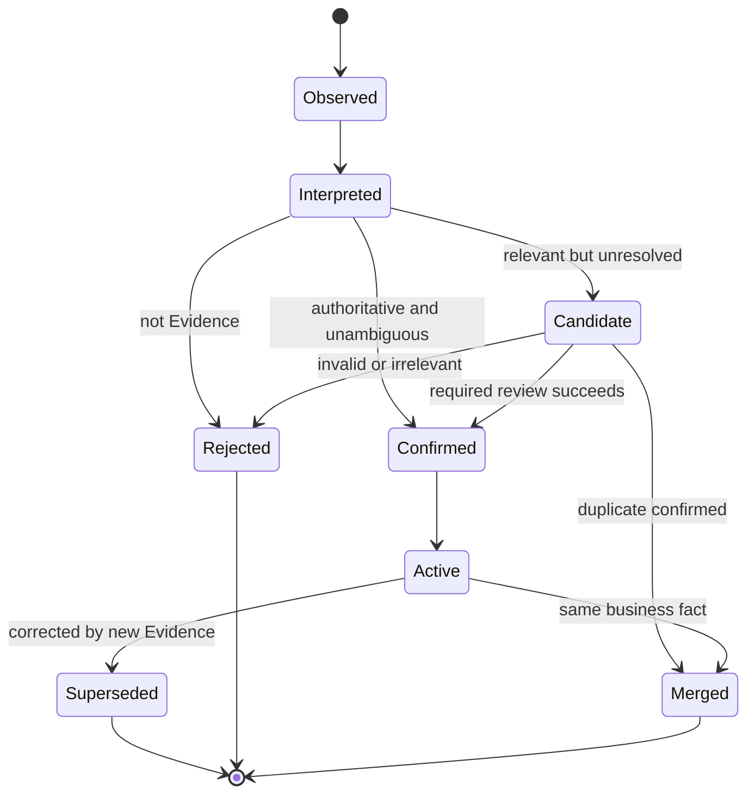
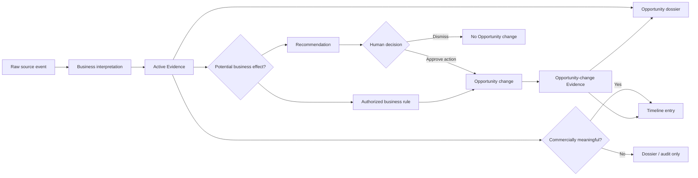
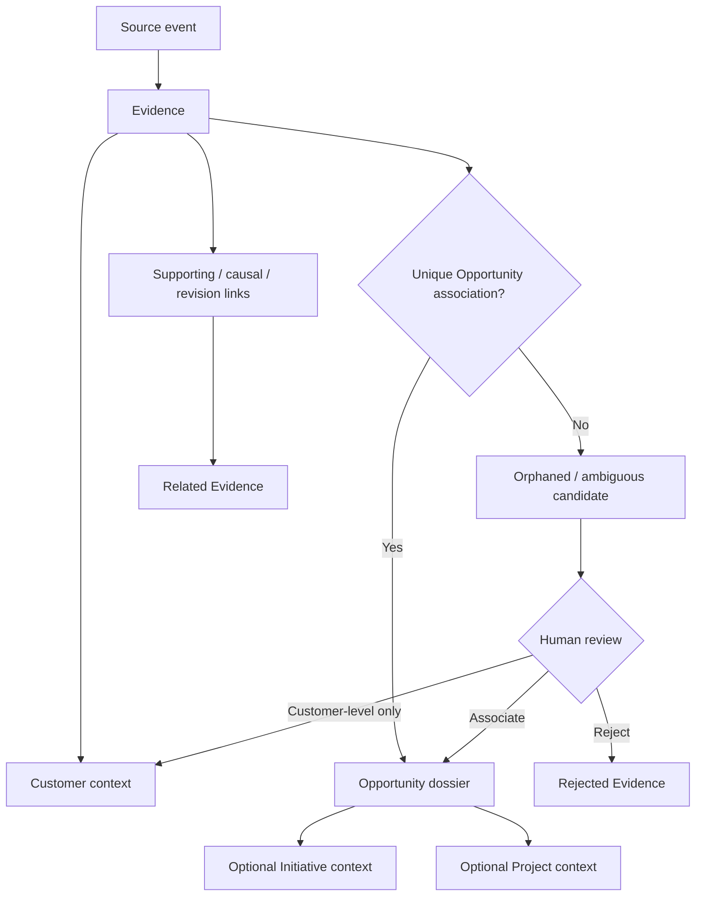
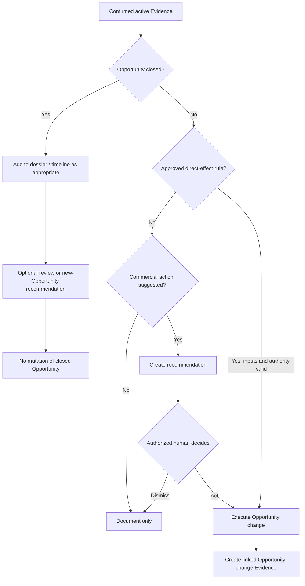
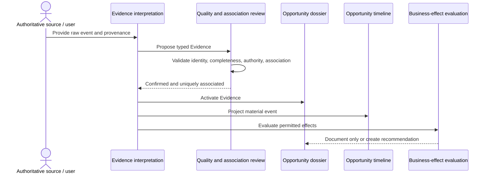
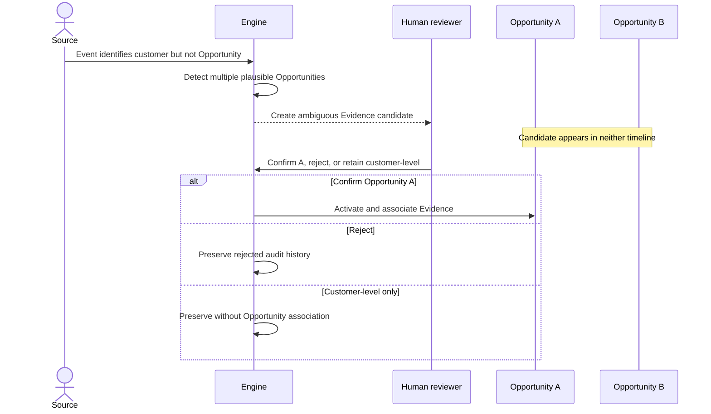
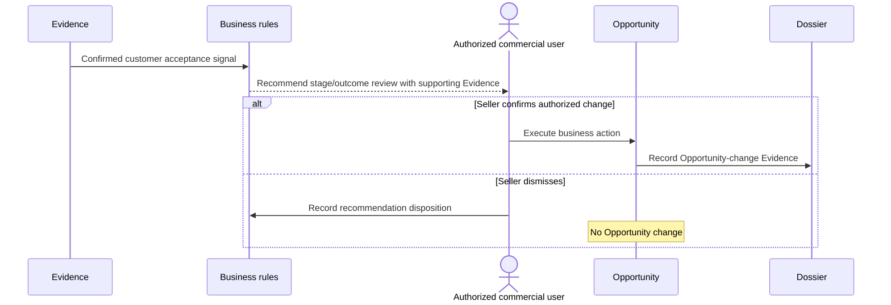
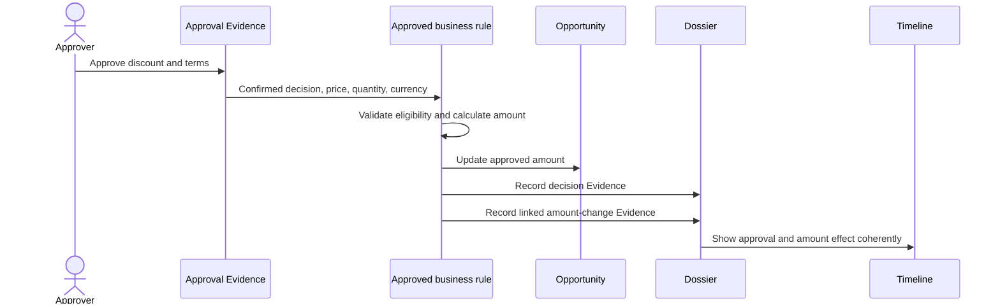
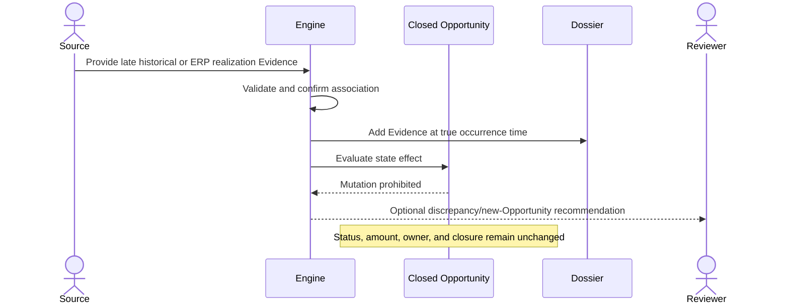

# Commercial Command Center — Opportunity Evidence Engine

**Document type:** Product and business-behavior specification  
**Status:** Definitive Sprint 1.2 baseline  
**Scope:** Opportunity Evidence Engine  
**Audience:** Product, Architecture, Backend, Frontend, QA, and AI teams

> This specification defines business semantics. It is intentionally independent of storage, programming language, framework, service, API, and user-interface choices.

## 1. Purpose

The Opportunity Evidence Engine defines how commercially meaningful facts become part of an Opportunity's permanent commercial dossier.

Its purpose is to ensure that an Opportunity is understood through verifiable events accumulated over time rather than through isolated records or an unexplained current state. It establishes one business language for visits, activities, quotes, approvals, commitments, documents, ERP transactions, decisions, and other commercial events.

The engine must answer five questions consistently:

1. What happened?
2. What supports that assertion?
3. Which Opportunity does it concern?
4. What commercial meaning does it have?
5. May it document, recommend, or change anything?

The engine does not replace the source systems that produced a fact. ERP systems remain systems of record for ERP transactions. The engine gives those facts Opportunity context, traceability, and business meaning.

The approved commercial hierarchy remains:

```text
Initiative
    ↓
Opportunity
    ↓
Project, only when special coordination is required
```

The Opportunity is the central commercial object. An Initiative may group multiple Opportunities. A Project is optional and exists only when the Opportunity requires additional coordination.

### Outcomes

The Evidence Engine provides:

- a coherent commercial dossier for each Opportunity;
- a chronological, understandable projection of that dossier;
- traceability from business Evidence to its origin;
- explicit rules for trusted, ambiguous, duplicate, corrected, and historical information;
- controlled boundaries between observation, recommendation, and Opportunity mutation;
- business-ready inputs for future recommendation capabilities without delegating decisions to them.

### Non-goals

This specification does not define:

- data structures or persistence;
- integration or application architecture;
- screen designs;
- AI algorithms;
- replacement of ERP authority;
- replacement of the current Opportunity aggregate;
- automated commercial judgment where human confirmation is required.

## 2. Business Definition

### Evidence

**Evidence is a traceable, commercially meaningful representation of an event, fact, decision, commitment, or artifact that concerns an Opportunity or may reasonably concern one.**

Evidence is not merely a copy of source data. It is the business interpretation that states what the source fact means in the commercial lifecycle.

Evidence must have:

- a recognizable business meaning;
- a source or accountable human author;
- an occurrence time or an explicit statement that it is unknown;
- a quality and association status;
- a stable identity within its source context;
- a preserved history when corrected or superseded.

### The five distinct concepts

| Concept | Definition | Authority | Example |
|---|---|---|---|
| **Raw data** | The source representation received or observed before commercial interpretation. | Originating system or author. | A spreadsheet row, ERP invoice, uploaded binary file, form submission. |
| **Business Evidence** | The normalized business assertion derived from a source fact and preserved in the dossier. | Evidence record plus provenance; authority varies by source. | “Customer visit occurred on 10 July” or “Discount was approved at 12%.” |
| **Timeline event** | A chronological presentation of one Evidence item or a meaningful Evidence transition. | Evidence; never independent authority. | “Descuento comercial aprobado” displayed on the Opportunity timeline. |
| **Recommendation** | A non-binding interpretation suggesting a future human action or review. | Advisory only. | “Consider advancing the Opportunity after customer acceptance.” |
| **Opportunity change** | An authorized mutation of commercial state, value, ownership, priority, or other Opportunity information. | Applicable business rule and authorized actor. | Update approved amount after an approval decision. |

These concepts must never be conflated:

- raw data may fail to become Evidence;
- Evidence may exist without a timeline entry;
- a timeline entry cannot change the Opportunity;
- a recommendation cannot change the Opportunity;
- an Opportunity change must produce its own Evidence, even when triggered by other Evidence.

### Commercial dossier

The **commercial dossier** is the complete body of active and historical Evidence associated with an Opportunity, including provenance, quality, relationships, corrections, and business effects.

The dossier is the authoritative commercial history. The timeline is only its chronological projection. The dossier may contain Evidence that is suppressed from the normal timeline because it is duplicated, rejected, merged, administrative, or too granular, while remaining auditable.

### Evidence candidate

An **Evidence candidate** is a source-derived assertion that has potential commercial meaning but has not yet satisfied the rules required to become active Evidence. Typical reasons are ambiguous Opportunity association, insufficient source identity, conflict, or required human confirmation.

A candidate must not be presented as a confirmed fact and must not change an Opportunity.

## 3. Evidence Principles

1. **Opportunity-centered:** Evidence is interpreted in the context of an Opportunity, even when it originates from a customer, Initiative, Project, or external system.
2. **Source-preserving:** Interpretation must not overwrite or disguise the original fact. Provenance remains available.
3. **Meaning before format:** Evidence semantics do not depend on the source's file, system, or transport format.
4. **One fact, one identity:** Repeated observation of the same source event must not create multiple active Evidence items.
5. **Append history; do not rewrite it:** Corrections and merges preserve prior assertions and their lineage.
6. **Event time is distinct from record time:** The date something happened is different from the date it became known to the Command Center.
7. **Evidence is not truth by declaration:** Quality, confidence, authority, and confirmation status must remain visible.
8. **Association is explicit:** Evidence cannot silently attach to an Opportunity based on an ambiguous match.
9. **Documentation is safer than mutation:** When business authority is uncertain, Evidence may document or recommend but must not change the Opportunity.
10. **Human accountability:** Material commercial judgments require an identifiable authorized human unless a pre-approved deterministic rule explicitly permits the effect.
11. **Closed means immutable:** New facts may enrich a closed dossier, but they do not silently reopen or modify the closed Opportunity.
12. **ERP authority remains intact:** Evidence derived from ERP describes ERP facts; it does not redefine or replace them.
13. **Timeline clarity:** The timeline should communicate important commercial history, not every technical synchronization or parsing action.
14. **Correction is not deletion:** Incorrect Evidence is marked, explained, and superseded or rejected; it is not erased from audit history.
15. **Recommendations are disposable; Evidence is durable:** Recommendations may expire or be dismissed without altering the underlying Evidence.
16. **No effect without trace:** Every Opportunity change caused or supported by Evidence must be traceable to that Evidence and must itself be represented as Evidence.

## 4. Evidence Categories

Categories express business meaning, not source system or presentation style. A source may produce Evidence in more than one category.

### 4.1 Commercial interaction Evidence

Documents direct engagement between commercial participants.

- customer visit;
- meeting;
- telephone or video call;
- commercial email or substantive written exchange;
- commercial note authored by an accountable user.

An interaction qualifies only when it describes a commercial exchange or observation. Login events, page views, synchronization attempts, and technical logs do not qualify.

### 4.2 Customer signal Evidence

Captures an explicit customer or market signal with commercial relevance.

- expressed need;
- requested product, quantity, date, or service;
- stated budget or constraint;
- competitor presence;
- objection or blocker;
- buying intent;
- postponement or loss signal;
- customer confirmation or rejection.

A customer signal may be embedded in a visit or message. It may be represented as a distinct Evidence item when it has independent commercial meaning. Extracted or inferred signals require confirmation unless they were explicitly structured and confirmed at capture.

### 4.3 Commercial instrument Evidence

Represents formal commercial artifacts and their material lifecycle events.

- quote or proposal issued;
- quote revised;
- quote expired, accepted, rejected, or cancelled;
- commercial approval requested, submitted, returned, approved, rejected, cancelled, or expired;
- approved price, discount, quantity, currency, and amount.

The instrument and each material transition are related Evidence. Minor formatting or technical regeneration without a commercial change does not create a new material timeline event.

### 4.4 Commitment and action Evidence

Represents a commitment made or an action agreed by a person or organization.

- follow-up created;
- due date or owner changed;
- follow-up completed or cancelled;
- customer commitment;
- seller commitment;
- agreed next step.

An overdue condition is a derived current condition, not a new source event. It may generate a recommendation or alert, but time passing alone does not fabricate historical Evidence.

### 4.5 Documentary Evidence

Represents an artifact that supports or contextualizes the commercial case.

- uploaded specification;
- customer purchase order;
- technical document;
- commercial proposal;
- meeting minutes;
- correspondence attachment;
- other attributable commercial file.

The file's existence and documented business purpose are Evidence. Its unreviewed contents are not automatically accepted as business assertions.

### 4.6 ERP transactional Evidence

Represents business transactions for which ERP remains authoritative.

- sales order created, changed, fulfilled, or cancelled;
- invoice or sale posted;
- credit or reversal;
- product purchase;
- transactional amount, quantity, currency, and date;
- customer/product transaction history relevant to the Opportunity.

ERP Evidence may support value realization, won-outcome verification, inactivity assessment, or customer purchase behavior. It must not be reinterpreted as an Opportunity match when the relationship is uncertain.

### 4.7 Opportunity decision and state Evidence

Documents an authorized change to the Opportunity itself.

- Opportunity created;
- stage/status changed;
- value changed;
- blocker changed;
- owner changed;
- priority changed;
- Opportunity closed as won, lost, or cancelled;
- closure reason and outcome details;
- correction to an allowed mutable attribute.

This Evidence is the audit consequence of a valid Opportunity change. It must record the previous and new business values when applicable, the actor, reason, and effective time.

### 4.8 Coordination Evidence

Documents optional coordination beyond ordinary Opportunity execution.

- Project initiated for the Opportunity;
- significant Project milestone, dependency, decision, or completion;
- engineering, manufacturer, joint-visit, discount, implementation, or cross-functional coordination event;
- Initiative association or removal when commercially meaningful.

Routine internal task noise does not belong in the Opportunity timeline. Only events that materially explain progress, risk, commitment, or outcome qualify.

### 4.9 Evidence administration

The following records preserve dossier integrity but are not commercial events in themselves:

- Evidence corrected;
- Evidence superseded;
- duplicate identified;
- Evidence merged;
- association confirmed, changed, or removed;
- Evidence rejected as invalid;
- source reprocessed without a business change.

They are audit facts. They may appear in an audit view but should enter the commercial timeline only when the correction materially changes the commercial interpretation.

### What does not qualify as Evidence

- application logs, retries, cache events, or synchronization heartbeats;
- a recommendation before a human acts on it;
- an unsupported inference stated as fact;
- duplicated observation of an already identified source event;
- temporary display calculations with no enduring commercial meaning;
- a blank, corrupt, or rejected source record;
- a technical file copy with no commercial purpose;
- passive passage of time;
- an Opportunity change request that was neither authorized nor executed.

## 5. Evidence Lifecycle

### Lifecycle states

1. **Observed:** a raw event or human assertion is received.
2. **Interpreted:** its potential business meaning and provenance are identified.
3. **Candidate:** it is commercially relevant but awaits association, validation, or required confirmation.
4. **Confirmed:** required business confirmation has occurred, or an authoritative deterministic source satisfies the confirmation rule.
5. **Active:** it belongs to the commercial dossier and may be projected to the timeline or evaluated for effects.
6. **Corrected / superseded:** a newer Evidence item replaces part or all of its assertion while retaining lineage.
7. **Merged:** multiple records were determined to represent the same business fact; one canonical Evidence identity remains active.
8. **Rejected:** the candidate was determined not to represent valid business Evidence.

“Historical” and “orphaned” are not lifecycle states:

- **Historical** describes an Evidence item whose occurrence predates its ingestion or the Opportunity's creation.
- **Orphaned** describes an Evidence item without a confirmed Opportunity association.

### Lifecycle rules

- Raw data remains distinguishable from the interpreted Evidence throughout the lifecycle.
- Candidate Evidence may be reviewed, corrected, associated, rejected, or merged; it cannot produce Opportunity changes.
- Confirmation must identify whether it was source-authoritative, rule-authoritative, or human-confirmed.
- Active Evidence is immutable in meaning. A correction produces a linked replacement and changes the predecessor's standing.
- Rejected Evidence remains auditable but is excluded from the commercial dossier's active facts and normal timeline.
- Superseded Evidence remains available in history and must not continue to drive recommendations or Opportunity effects.
- A source re-import that has no business difference updates observation context only; it does not create a new Evidence item or timeline event.



### Human confirmation boundary

Human confirmation is mandatory when:

- more than one Opportunity is a plausible association;
- associating Evidence would depend only on fuzzy text, proximity, or inferred intent;
- the source is not authoritative for the asserted fact;
- a correction changes material commercial meaning;
- a merge could combine distinct commercial events;
- the Evidence would cause a non-pre-approved Opportunity mutation;
- a customer signal was inferred from unstructured content;
- historical Evidence could alter a previously reported outcome;
- an action concerns a closed Opportunity beyond adding documentary history.

Human confirmation is not required when:

- an authoritative source provides a stable event identity and an explicit, unique Opportunity reference;
- the accountable user creates Evidence directly inside the known Opportunity;
- a deterministic, pre-approved business rule creates a purely documentary Evidence transition;
- a previously confirmed association remains unchanged during idempotent source reprocessing.

## 6. Opportunity Timeline

The Opportunity Timeline is the chronological narrative of commercially meaningful Evidence. It is a view of the dossier, not a separate source of truth.

### Timeline inclusion rules

An active Evidence item appears in the normal timeline when it:

- records a meaningful customer interaction;
- records an explicit need, risk, blocker, decision, or commitment;
- creates or materially changes a quote, approval, follow-up, Project milestone, or Opportunity state;
- records a commercially relevant document;
- records an ERP transaction materially associated with the Opportunity;
- corrects a fact in a way that changes the commercial narrative.

The normal timeline excludes:

- rejected candidates;
- unresolved orphaned Evidence;
- duplicate observations;
- technical synchronization/audit noise;
- non-material administrative changes;
- recommendations that have not become actions;
- raw source payloads as separate events.

### Chronology

- Primary ordering uses **occurrence time**: when the business event happened.
- When occurrence time is unknown, the timeline uses recorded time and marks the date as unknown or approximate.
- Late-arriving historical Evidence is placed at its actual occurrence point, not at the time of import.
- The user must be able to recognize that historical Evidence was added later.
- When several events share the same occurrence time, their business sequence and then record time determine a stable order.
- Corrections do not rewrite the original time. The corrected fact occupies the appropriate business time and exposes its correction history.

### Timeline representation

Each entry must communicate, in business language:

- Evidence category and type;
- concise event title;
- what happened and why it matters;
- occurrence date/time and, when relevant, recorded date/time;
- responsible actor or authoritative source;
- status such as confirmed, corrected, or historical;
- relationship to instruments, Project, Initiative, or other Evidence;
- resulting Opportunity effect, if any;
- access to supporting detail or artifact.

Color alone must never be the sole indicator of type or status. Pending, approved, returned, rejected, cancelled, corrected, ambiguous, and historical meanings require text or iconography as well.

### Timeline grouping

- One Evidence item may produce at most one normal timeline entry for the same material transition.
- Closely related technical updates may be summarized under one commercial event.
- Approval history remains available in full, while only material approval transitions appear in the Opportunity timeline.
- A quote revision appears separately when price, quantity, scope, currency, validity, or commercial terms materially change.
- An Opportunity amount updated because of approval should normally be shown as the effect within the approval entry, not duplicated as an unrelated event. The Opportunity-change Evidence remains traceable in the dossier.



## 7. Evidence Behavior Matrix

“Human confirmation” below concerns activation/association or effect. An accountable user entering an event directly in a known Opportunity already supplies confirmation for the asserted event, subject to their authority.

| Evidence type | Activation and association rule | Normal timeline behavior | Possible business effect | Human confirmation boundary | Closed Opportunity behavior |
|---|---|---|---|---|---|
| Opportunity created | Authorized creation is self-confirming. | Always shown. | Establishes initial Opportunity state. | Creator must be authorized. | Not applicable at creation. |
| Manual call, meeting, email, or note | Active when authored in a known Opportunity by an accountable user. | Shown if commercially substantive. | May support a recommendation; never changes stage by itself. | No extra confirmation for documentation. Any resulting change is separate. | May be appended as historical/documentary Evidence; cannot alter closed state. |
| Imported commercial visit | Stable source identity plus unique association; otherwise candidate. | Shown after association, using visit date. | May create a recommendation or a separately confirmed follow-up. | Required for ambiguous association and inferred signals. | May enrich history; cannot reopen or mutate the outcome. |
| Expressed need / buying signal | Explicit structured capture is confirmable; extracted inference remains candidate. | Shown when material. | May recommend creation, qualification, stage review, or amount review. | Required for inferred meaning and all Opportunity changes. | Documents post-close context; may recommend a new Opportunity, not reopen this one. |
| Risk, objection, competitor, or blocker signal | Must be attributable and Opportunity-associated. | Shown when material. | May recommend blocker/status/priority review. | Required before changing blocker, stage, loss reason, or priority unless directly entered as that authorized change. | Documents outcome context only; cannot rewrite closure. |
| Follow-up created | Confirmed by accountable creator or explicit source commitment. | Shown if it represents a meaningful next step. | Creates an action obligation, not an Opportunity state change. | Imported/inferred follow-ups require confirmation. | Existing follow-up history remains; new operational follow-ups should target a new/open context unless explicitly allowed by policy. |
| Follow-up rescheduled | Requires authorized owner/date change. | Shown when commercially material; minor edits may be dossier-only. | Changes the action commitment only. | Actor must be authorized. | Cannot modify a closed Opportunity's operational commitments; may add a documentary note. |
| Follow-up completed/cancelled | Confirmed by accountable actor. | Shown when it closes a material next step. | May prompt reassessment, but no automatic stage change. | Required from accountable actor. | Historical completion may be documented; no Opportunity mutation. |
| Follow-up overdue | Derived condition, not independent Evidence. | Not a historical event merely because time passed. | Recommendation/alert only. | Human decides any commercial response. | No effect; closed dossiers do not accumulate operational overdue alerts. |
| Quote issued | Confirmed by authoritative quote source or accountable issuer and unique association. | Always shown when commercially material. | May support value/stage recommendations. | Ambiguous match requires confirmation. Issuance alone does not change stage/value unless an approved deterministic rule says so. | May be added historically; cannot change closed outcome. |
| Quote revised | New material commercial terms create related Evidence; cosmetic regeneration does not. | Shown for material revisions with prior/new summary. | May recommend Opportunity amount or stage review. | Human confirms Opportunity changes. | Preserved as post-close/historical Evidence without mutation. |
| Quote accepted/rejected/expired/cancelled | Must come from authoritative status or accountable confirmation. | Always shown. | Acceptance may recommend win/stage review; rejection may recommend loss/revision review. | Closing or changing the Opportunity requires authorized human confirmation. | Records later knowledge only; does not change closure. |
| Approval request created | Active when created in a known open Opportunity. | Shown as a material commercial event. | None at draft creation. | Accountable requester. | New requests are prohibited for closed Opportunities. Historical requests may be associated without effect. |
| Approval submitted | Confirmed transition of a valid request. | Shown. | Indicates pending commercial decision; no amount change. | Authorized submitter. | Prohibited for closed Opportunities. |
| Approval returned | Authoritative approver decision. | Shown with comments. | Returns request for revision; no Opportunity amount change. | Authorized approver. | Cannot occur as a new decision on a closed Opportunity. Historical import is documentary. |
| Approval rejected | Authoritative approver decision. | Shown with reason/comments. | No Opportunity amount change; may recommend commercial reassessment. | Authorized approver. | Same closed rule as above. |
| Approval cancelled/expired | Authorized transition or deterministic expiry under approved policy. | Shown when material. | No amount/state change. | Cancellation requires authorized actor; deterministic expiry may not. | May document pre-close history; cannot mutate closure. |
| Discount approved | Authoritative approver decision with validated terms. | Always shown with requested/approved discount, price, quantity, total, actor, date, and comments. | Updates approved Opportunity amount only when the approved business rule explicitly defines that effect; the change creates separate linked Opportunity-change Evidence. | Approver decision is mandatory; calculations are not discretionary. | Cannot approve against a closed Opportunity. Historical approved Evidence is added without changing closed amount. |
| Commercial/technical document uploaded | Accountable uploader, known Opportunity, stated document purpose. | Shown if material; otherwise dossier-only. | Documentary only unless an authorized person acts on its contents. | Contents require review before producing derived assertions/effects. | May be added to complete the dossier; no mutation. |
| Customer purchase order | Authoritative artifact/source and unique association. | Always shown. | May recommend won closure or verify outcome; does not close automatically. | Ambiguous association and Opportunity closure require human confirmation. | May verify a won outcome; discrepancies trigger review, not automatic correction. |
| ERP sales order | ERP-authoritative and uniquely associated. | Shown if material to the Opportunity. | May recommend value/outcome review. | Association and any Opportunity change require confirmation unless explicit reference is conclusive and a pre-approved effect exists. | Adds realization history; does not reopen or overwrite. |
| ERP invoice/sale | ERP-authoritative and uniquely associated. | Shown or summarized when material. | May verify realized value and generate variance recommendations. | Ambiguous match or outcome correction requires human review. | Adds realization Evidence; closed status and approved/won value remain unchanged unless a separate authorized correction process exists. |
| ERP credit/reversal/cancellation | ERP-authoritative. | Always shown when linked to previously material ERP Evidence. | May generate discrepancy/risk recommendation. | Any Opportunity outcome/value correction requires authorization. | Does not silently reverse a won Opportunity. |
| Opportunity status/stage changed | Valid authorized change. | Always shown with previous/new state and reason when required. | The event is the change. | Authorized human except deterministic transitions explicitly approved elsewhere. | Ordinary stage changes are prohibited. |
| Opportunity amount changed | Valid authorized rule/action with prior/new amount and currency. | Always shown or embedded with its causal approval while remaining traceable. | The event is the change. | Human confirmation unless directly caused by an approved, deterministic approval rule. | Prohibited; later financial Evidence documents variance only. |
| Opportunity blocker/owner/priority changed | Authorized change. | Shown when commercially meaningful. | The event is the change. | Authorized human. | Prohibited. |
| Opportunity closed won/lost/cancelled | Authorized closure with required outcome facts. | Always shown. | Makes the Opportunity read-only. | Explicit authorized human confirmation. | The closure defines the closed state. |
| Project created/milestone/decision/completed | Must be tied to the Opportunity and commercially material. | Shown when it explains coordination, progress, risk, or outcome. | May recommend Opportunity reassessment; does not change it automatically. | Project accountable actor; Opportunity effects separately confirmed. | Historical coordination may be added; no closed mutation. |
| Initiative association changed | Authorized commercial grouping decision. | Dossier-only unless materially important. | Changes grouping, not Opportunity stage/value. | Authorized actor. | Existing association is immutable through ordinary closed workflows; corrections require governed administrative handling. |
| Evidence corrected | Replacement must identify predecessor, reason, and actor/source. | Shown when commercial meaning changes; otherwise audit-only. | Re-evaluates recommendations; never silently reverses an already executed Opportunity change. | Material correction requires accountable review. | Allowed to correct dossier truth; closed Opportunity attributes remain immutable. |
| Evidence merged as duplicate | Confirmed same real-world fact. | One canonical event; merge audit is normally hidden. | Removes duplicate influence from summaries/recommendations. | Required when identity is not source-conclusive. | Allowed; no change to closed outcome. |
| Orphaned/ambiguous candidate | Insufficient association. | Never shown in an Opportunity timeline. | None. | Human must confirm association or reject. | May be associated to a closed dossier for history, but has no mutation rights. |

## 8. Evidence Metadata

Metadata is the minimum business context required to understand and trust Evidence. This section defines information, not a storage design.

### Identity

- Evidence identity;
- Evidence type and category;
- source event identity, when supplied;
- canonical identity when duplicates are merged;
- version/correction lineage.

### Provenance

- source system, organization, artifact, or human author;
- source authority level for the asserted fact;
- responsible actor and role, when human-created or confirmed;
- original source reference sufficient for audit;
- observation/receipt time;
- confirmation method: source-authoritative, deterministic rule, or human-confirmed.

### Time

- occurrence/effective date and time;
- recorded/received date and time;
- precision: exact, date-only, approximate, or unknown;
- source time zone when relevant;
- historical/late-arriving indicator.

### Business meaning

- concise title and description;
- involved customer, contact, seller, approver, advisor, or other parties when known;
- product/service, quantity, amount, currency, discount, or commercial terms when relevant;
- stage, status, blocker, decision, commitment, or result when relevant;
- reason/comments required by the Evidence type;
- materiality to the Opportunity.

### Relationships

- associated Opportunity and association status;
- associated customer;
- optional Initiative and Project context;
- parent instrument or process, such as quote or approval;
- causal Evidence, resulting Evidence, predecessor, correction, supersession, and merge relationships;
- supporting documents and source references.

### Quality and governance

- quality status and identified issues;
- completeness and validity outcome;
- association certainty;
- duplicate status;
- active, superseded, merged, or rejected standing;
- confirmation actor/date/reason;
- correction or rejection reason;
- restrictions on business effects.

### Business effects

- whether the Evidence is documentary only;
- recommendation(s) produced, if any;
- permitted effect type under approved rules;
- Opportunity change actually executed, including previous/new value;
- accountable decision actor;
- effect time and rationale.

Evidence metadata must distinguish unknown from empty, not applicable, and zero. For example, “no known amount” is not an amount of zero, and “no historical comparison” is not zero change.

## 9. Relationship Rules

### Opportunity relationship

1. Active Evidence belongs to zero or one primary Opportunity at a time.
2. Evidence with no confirmed Opportunity is orphaned candidate Evidence, not part of an Opportunity dossier.
3. A direct, stable Opportunity reference from an authoritative source is sufficient for automatic association.
4. Evidence entered inside a known Opportunity is associated to that Opportunity by the accountable actor.
5. Customer identity alone is insufficient when multiple plausible Opportunities exist.
6. Product, quote number, date proximity, seller, amount, or free text may support a match but cannot independently resolve ambiguity unless an approved deterministic rule guarantees uniqueness.
7. Ambiguous Evidence must remain outside all Opportunity timelines until confirmed.
8. Changing an association preserves the prior association history and requires a reason.
9. Removing an incorrect association removes the Evidence from that Opportunity's active dossier/timeline but does not erase its audit history.

### Shared event rule

A real-world event may concern multiple Opportunities. It must not be falsely forced into one of them.

- If the event contains separable assertions or amounts, each Opportunity receives its own related Evidence item pointing to the shared source event.
- If it cannot be meaningfully allocated, it remains customer-level Evidence until a human determines the relationship.
- Copies must retain a shared-source relationship and must not be counted as multiple real-world events in customer-level analytics.

### Customer relationship

- Evidence may be confidently related to a customer but not to an Opportunity.
- Customer-level Evidence may support discovery or recommendations but does not enter an Opportunity timeline until associated.
- Creating an Opportunity from customer-level Evidence is a human business action. The originating Evidence becomes linked to the new Opportunity without changing its original occurrence time.

### Initiative relationship

- Initiative membership provides grouping context; it does not make every Initiative event Evidence for every Opportunity.
- Only an event that materially concerns a specific Opportunity is placed in that Opportunity's dossier.
- One Initiative may contain many Opportunities without blending their Evidence histories.

### Project relationship

- A Project is optional and subordinate to an Opportunity.
- Project Evidence enters the Opportunity dossier only when it materially explains commercial progress, coordination, risk, commitment, or outcome.
- Internal Project execution details that lack commercial meaning stay outside the commercial dossier.

### Evidence-to-Evidence relationships

- **Supports:** one Evidence item corroborates another.
- **Causes:** one Evidence item is the authorized cause/input of another, such as approval causing an amount change.
- **Responds to:** a decision or activity responds to earlier Evidence.
- **Revises:** a quote or commitment replaces earlier terms without invalidating that they existed.
- **Corrects/supersedes:** a later assertion declares an earlier assertion inaccurate.
- **Duplicates/merges with:** multiple records represent one business fact.
- **Contradicts:** two active assertions conflict and require review; neither is silently discarded.



## 10. Evidence Quality

### Quality dimensions

| Dimension | Question |
|---|---|
| Provenance | Can the origin and responsible actor/system be identified? |
| Identity | Can this event be distinguished from re-observation or another event? |
| Completeness | Are the facts required for this Evidence type present? |
| Validity | Are values, dates, states, and terms internally valid? |
| Authority | Is the source authoritative for the asserted fact? |
| Association | Is the relevant customer and Opportunity relationship established? |
| Consistency | Does the Evidence conflict with related Evidence or Opportunity facts? |
| Timeliness | Was it received close to occurrence, or is it historical? |
| Materiality | Does it help explain a commercial decision, commitment, state, risk, or outcome? |

### Quality statuses

- **Confirmed:** sufficient quality and association for active use.
- **Confirmed with warnings:** active but carries non-blocking limitations visible to users and downstream consumers.
- **Pending review:** potentially valid, but confirmation or association is incomplete.
- **Ambiguous:** multiple interpretations or associations are plausible.
- **Conflicting:** contradicts another authoritative or confirmed assertion.
- **Rejected:** invalid, irrelevant, or unsupported.
- **Superseded:** historically valid or previously accepted but replaced by a correction.
- **Merged duplicate:** retained as lineage but not independently active.

### Quality effects

- Only confirmed Evidence may drive approved business effects.
- Confirmed-with-warnings Evidence may support recommendations, but the warning must follow it.
- Pending, ambiguous, conflicting, rejected, superseded, and duplicate Evidence cannot drive an Opportunity change.
- Missing optional information reduces richness but does not invalidate otherwise sufficient Evidence.
- Missing required information prevents activation for that Evidence type.
- Quality resolution must be attributable and auditable.
- A higher-authority source does not automatically erase lower-authority conflicting Evidence; it establishes the likely canonical fact while preserving the conflict history.

### Confidence language

The product may communicate certainty using business terms such as confirmed, pending review, or ambiguous. A numeric confidence score must not be presented as fact unless its definition and decision rights are separately approved. No numeric confidence model is defined by this specification.

## 11. Business Rules

### General rules

1. Every active Evidence item must be commercially meaningful, traceable, and quality-classified.
2. Raw data is never displayed as confirmed Evidence merely because it was imported successfully.
3. A source event may produce multiple Evidence items only when it contains distinct business assertions; the relationship to the common source must remain visible.
4. Reprocessing the same source event is idempotent in business terms.
5. A timeline entry is generated from Evidence; it cannot exist as an untraceable independent fact.
6. Evidence that causes an Opportunity change and the resulting Opportunity-change Evidence must be linked.
7. No recommendation changes Opportunity data.
8. No ambiguous or orphaned Evidence changes Opportunity data.
9. No document contents create business facts until reviewed or otherwise authoritatively structured.
10. No inferred customer intent, acceptance, rejection, or commitment is treated as confirmed without an accountable confirmation boundary.

### Duplicate and merge rules

- Exact source identity duplicates resolve automatically to the existing canonical Evidence.
- Probable duplicates remain separate candidates until source identity or a human confirms equivalence.
- A merge identifies one canonical Evidence item and preserves all source references and review history.
- Merging must not sum amounts, counts, visits, or effects twice.
- A merge can be reversed only through an accountable correction process; original lineage remains visible.

### Correction rules

- A corrected fact creates new Evidence linked to the Evidence it corrects.
- The correction must state who/what corrected it, when, and why.
- The original Evidence remains visible as superseded in audit history.
- Timeline presentation shows the corrected current narrative without pretending the original never existed.
- Recommendations are reevaluated against active Evidence.
- Already executed Opportunity changes are not silently undone. Any reversal or correction is a new authorized Opportunity action with its own Evidence.

### Historical Evidence rules

- Historical Evidence uses its true occurrence date and is marked late-arriving.
- It may fill gaps in the dossier and timeline.
- It must not silently recalculate or rewrite decisions that were made with the information available at the time.
- Any proposed retrospective change is a recommendation requiring authorized review.

### Closed Opportunity rules

1. Won, lost, and cancelled Opportunities are read-only.
2. Closed Opportunities may receive new Evidence when it documents facts that occurred before closure, verifies realization after closure, corrects dossier truth, or records relevant post-close outcomes.
3. New Evidence must not change closed status, amount, owner, blocker, priority, closure reason, or other Opportunity attributes.
4. Recommendations concerning a closed Opportunity cannot execute changes against it.
5. A newly discovered commercial need after closure should recommend a new Opportunity when appropriate, not reuse the closed one.
6. Approval requests, operational follow-ups, quote revisions intended for active negotiation, and ordinary stage changes cannot be initiated against a closed Opportunity.
7. ERP invoices, credits, cancellations, or late documents may expose variances against the closed outcome; they create Evidence and review recommendations only.
8. Evidence correction and duplicate resolution remain allowed because they maintain dossier truth, but they do not mutate the closed Opportunity.
9. Reopening is not an Evidence Engine behavior. Unless a separate approved business policy is established, a closed Opportunity remains closed.

### Deletion rule

Confirmed Evidence must not be hard-deleted as an ordinary business action. Invalid or legally restricted content may be hidden or removed under a separately governed process, while preserving the minimum audit fact permitted by policy. The retention and legal-erasure policy is an Open Question.

## 12. State Interaction

Evidence and Opportunity state interact through three explicitly separated paths.

### Path A — Documentary only

The Evidence explains history and produces no recommendation or change.

Examples:

- meeting minutes uploaded;
- commercial note recorded;
- historical visit associated;
- ERP invoice confirming an already documented result.

### Path B — Recommendation

The Evidence satisfies a rule suggesting that a human reassess the Opportunity.

Examples:

- accepted quote suggests reviewing whether to close as won;
- rejected quote suggests revising or closing as lost;
- customer need suggests qualification or a new Opportunity;
- long inactivity suggests follow-up;
- ERP reversal suggests outcome discrepancy review.

A recommendation has a reason, supporting Evidence, target action, created time, and disposition. It may be accepted, dismissed, superseded, or expire. Acceptance means an authorized human chooses an action; it does not mean the recommendation itself performed the action.

### Path C — Authorized deterministic effect

Evidence may produce a direct Opportunity change only when all are true:

- the effect is explicitly approved as a business rule;
- the Evidence is confirmed and uniquely associated;
- the source/actor has the required authority;
- all inputs are valid and complete;
- the Opportunity is open and eligible;
- the calculation or transition is deterministic;
- the resulting change is recorded as linked Opportunity-change Evidence.

The current product behavior explicitly recognized by this specification is that an authorized commercial approval may update the approved Opportunity amount using the approved price, quantity, and currency. The approver's human decision is the authorization; the arithmetic is deterministic.

No other automatic stage, closure, ownership, blocker, priority, or value mutation is approved by this specification.

### State interaction table

| Evidence result | Timeline | Recommendation | Opportunity mutation |
|---|---:|---:|---:|
| Confirmed documentary fact | When material | Optional | No |
| Confirmed signal | When material | Allowed | No |
| Confirmed authorized decision without defined effect | Yes | Optional | No |
| Approved discount with valid deterministic amount rule | Yes | Not required for amount effect | Amount only, plus change Evidence |
| Candidate/ambiguous/orphaned | No | Review association only | No |
| Rejected/duplicate/superseded | Audit only | No new recommendation | No |
| Evidence on closed Opportunity | When historically/materially relevant | Review/new-Opportunity suggestion only | No |



## 13. Future AI Integration

AI may participate in the future as an advisory interpreter, never as an untraceable authority.

### Permitted future inputs

- confirmed Evidence and its provenance/quality;
- Opportunity state and authorized commercial context;
- chronological dossier/timeline;
- active agreements, quotes, approvals, visits, commitments, and ERP transaction Evidence;
- correction, contradiction, duplicate, and warning context;
- human dispositions of prior recommendations.

### Permitted future outputs

- candidate Evidence extracted from unstructured content;
- possible duplicate or association suggestions;
- summaries of confirmed Evidence;
- risk, missing-information, next-action, or prioritization recommendations;
- explanations linking a recommendation to supporting Evidence;
- draft text for a human to review.

### Mandatory boundaries

- AI output is not Evidence until provenance, type-specific validation, association, and confirmation rules are satisfied.
- AI-inferred customer intent, commercial commitment, decision, quote acceptance, or loss reason requires human confirmation.
- AI cannot approve discounts, close/reopen Opportunities, alter amount/stage/owner/blocker/priority, merge Evidence, or correct confirmed Evidence.
- AI cannot turn ambiguous Evidence into confirmed Evidence by confidence score alone.
- AI recommendations must cite the Evidence that supports them and disclose relevant uncertainty/conflicts.
- Users must be able to dismiss or correct an AI recommendation without changing the underlying Evidence.
- Closed Opportunity rules apply equally to AI: it may summarize or recommend a new Opportunity, but cannot mutate the closed record.

AI model choice, prompting, scoring, training, evaluation, and operational architecture are outside scope.

## 14. Sequence Diagrams

### 14.1 Authoritative event with a unique Opportunity



### 14.2 Ambiguous Evidence association



### 14.3 Evidence recommendation and human decision



### 14.4 Approved discount with deterministic amount effect



### 14.5 Correction and duplicate merge

```mermaid
sequenceDiagram
    actor Reviewer
    participant Old as Existing Evidence
    participant New as Corrected/duplicate candidate
    participant Dossier
    participant Timeline
    participant Recs as Recommendations

    Reviewer->>New: Confirm correction or duplicate relationship
    alt Correction
        New->>Old: Supersedes with reason and lineage
        New->>Dossier: Become active corrected Evidence
        Dossier->>Timeline: Update narrative; retain audit history
    else Duplicate
        New->>Old: Merge into canonical Evidence
        Dossier->>Timeline: Keep one commercial event
    end
    Dossier->>Recs: Reevaluate against active canonical Evidence
    Note over Dossier: Prior Opportunity changes are not silently reversed
```

### 14.6 Late Evidence on a closed Opportunity



## 15. Edge Cases

### Duplicate Evidence

- Same source event received repeatedly: retain one canonical active Evidence item; do not repeat timeline or effects.
- Different source identities that appear similar: keep separate candidates until equivalence is confirmed.
- Same meeting entered manually and imported from a visit source: merge only when participants, occurrence, context, and accountable review establish one real-world event.

### Orphaned Evidence

- Known customer, no Opportunity: retain as customer-level/orphaned candidate; exclude from Opportunity timelines.
- Unknown customer and Opportunity: retain for quality review only if provenance and commercial meaning are sufficient; otherwise reject.
- Opportunity later created from the Evidence: associate it while preserving original occurrence and receipt times.

### Ambiguous Evidence

- Multiple open Opportunities for the same customer/product/date: require human selection.
- One quote covers multiple Opportunities: split only with defensible allocation; otherwise keep at customer level.
- Ambiguity cannot be resolved by choosing the newest or highest-value Opportunity without an approved rule.

### Historical and late-arriving Evidence

- Insert chronologically by occurrence time and mark as late-arriving.
- Do not silently change past state or invalidate decisions made without that information.
- A historical approval or quote on a closed Opportunity documents the dossier but cannot reapply its effect.

### Corrected Evidence

- Wrong date, amount, party, or association: create a correction with reason and lineage.
- Minor non-semantic formatting correction: audit-only; no new timeline event.
- Material correction: update timeline narrative and reevaluate current recommendations.
- Correction that would imply an Opportunity value/state reversal: requires a separate authorized business action; never happens implicitly.

### Merged Evidence

- Keep one canonical commercial fact with all source references.
- Prevent duplicated counts, values, timeline entries, and recommendations.
- Preserve who approved the merge and why.
- If a merge was wrong, correct the merge through an accountable process; do not erase history.

### Conflicting Evidence

- Quote says accepted while later customer message says rejected: show conflict and require review.
- ERP transaction differs from approved/won amount: preserve both authoritative facts in their own domains and generate a discrepancy review.
- A conflict blocks direct effects dependent on the disputed fact.

### Missing or invalid time

- Date-only event: preserve date-only precision; do not invent a time.
- Unknown occurrence date: order by recorded time and label occurrence unknown.
- Future date where impossible: candidate with validation issue, not active Evidence.
- Source correction of time follows normal correction rules.

### Partial and evolving events

- Draft quote or approval is Evidence of a draft/request only, not of issuance or approval.
- A partially fulfilled order may produce progressive ERP Evidence without duplicating the order identity.
- Material revisions create related Evidence; non-material sync differences do not.

### Source deletion or disappearance

- Disappearance from a source does not erase confirmed Evidence.
- An authoritative cancellation/deletion fact may supersede the prior standing.
- If disappearance cannot be interpreted, flag for review rather than inferring cancellation.

### Shared events

- A visit involving several Opportunities is represented through related Opportunity-specific Evidence only when the assertions can be separated.
- Customer-level portions remain customer-level and must not be duplicated across dossiers.

### Closed Opportunities

- Late invoice after won closure: realization Evidence, no state/value rewrite.
- Credit after won closure: discrepancy Evidence and review recommendation, no automatic reversal.
- New buying need after lost/cancelled closure: recommend creating a new Opportunity.
- Incorrect Evidence in a closed dossier: correction/merge allowed; closed attributes unchanged.
- Attempted new approval, quote negotiation, follow-up, or stage change: prohibited against the closed Opportunity.

### Privacy or restricted information

Evidence may contain personal, competitive, contractual, or commercially sensitive information. Visibility, retention, redaction, and legal deletion rules are not defined here and must be resolved as product governance questions.

## 16. Open Questions

The following require product or governance decisions. This specification does not invent answers.

1. Which roles may confirm association, correct, reject, merge, or detach each Evidence category?
2. Which roles may view sensitive approval, competitor, contact, margin, or documentary Evidence?
3. What retention and legally required deletion/redaction policy applies to Evidence and raw source artifacts?
4. Which customer-level Evidence should be retained when no Opportunity ever exists?
5. What exact business threshold makes a quote revision or Project event “material” for the normal timeline?
6. Should one Evidence item ever have multiple primary Opportunities, or must shared events always be decomposed into related Opportunity-specific Evidence?
7. What allocation rules, if any, permit one ERP order/invoice or quote to be divided among Opportunities?
8. Which source references are sufficiently authoritative and unique to permit automatic Opportunity association?
9. Beyond approved discount amount updates, are any deterministic direct Opportunity effects desirable and governable?
10. Should accepted quotes or purchase orders ever close an Opportunity automatically, or always remain recommendations?
11. Is reopening a closed Opportunity ever permitted under a separate governance process? If so, who may authorize it and how is the original closure preserved?
12. How should corrections to won amount or closure reason be governed when ERP realization contradicts the dossier?
13. Should post-close operational actions live under a new Opportunity, customer workspace, service case, or another future object?
14. How long may an ambiguous candidate remain pending, and who owns resolution?
15. What notification/escalation behavior should apply to unresolved conflicts, orphaned Evidence, and expiring recommendations?
16. What recommendation lifecycle, expiry, ownership, and dismissal reasons are required?
17. What evidence-quality metrics should managers see without incentivizing low-value activity capture?
18. Which contact communications may be retained as Evidence under privacy and consent policies?
19. What source-authority hierarchy resolves contradictions between human entries, customer documents, ERP, manufacturer systems, and imported sources?
20. What multilingual terminology and localization rules apply to Evidence titles and source content?

## 17. Acceptance Criteria

The Opportunity Evidence Engine product behavior satisfies this specification when all of the following are true:

### Model and separation

- Evidence is defined as a business abstraction independent of implementation choices.
- Raw data, Evidence, timeline entries, recommendations, and Opportunity changes remain distinguishable throughout every workflow.
- The Opportunity dossier is the complete Evidence history; the timeline is a chronological projection and not the source of truth.
- Initiative remains above Opportunity, and Project remains optional coordination below Opportunity.

### Type behavior

- Commercial interactions, visits, customer signals, quotes, approvals, follow-ups, documents, ERP transactions, Opportunity changes, and coordination events follow the explicit rules in the behavior matrix.
- Each material approval transition appears once in the Opportunity timeline.
- Approved discount Evidence displays the decision terms and traces any approved amount change.
- ERP Evidence preserves ERP authority and does not replace ERP records.

### Quality and relationships

- Every active Evidence item has traceable provenance, business type, occurrence context, quality status, and confirmed Opportunity association.
- Ambiguous or orphaned Evidence appears in no Opportunity timeline and causes no Opportunity change.
- Duplicate observation creates no duplicate active Evidence, timeline event, count, amount, recommendation, or effect.
- Merged Evidence retains all source lineage and one canonical commercial identity.
- Corrected Evidence preserves its predecessor and correction reason.
- Historical Evidence is ordered by actual occurrence time and visibly identified as late-arriving.
- Conflicting Evidence remains visible for review and blocks dependent direct effects.

### Human authority and effects

- Human confirmation boundaries are explicit and enforceable for association, inferred signals, material corrections, merges, commercial decisions, and non-pre-approved Opportunity changes.
- Recommendations are advisory and cannot mutate the Opportunity.
- Candidate, ambiguous, conflicting, rejected, superseded, and duplicate Evidence cannot mutate the Opportunity.
- Every authorized Opportunity change produces linked Opportunity-change Evidence with prior/new values and actor/reason when applicable.
- The only direct effect explicitly recognized here is the deterministic approved-amount update following an authorized commercial approval; no other automatic state mutation is implied.

### Closed Opportunities

- Won, lost, and cancelled Opportunities remain read-only.
- Late, historical, realization, documentary, corrected, and merged Evidence may enrich a closed dossier without altering the closed Opportunity.
- New negotiation actions cannot be initiated against a closed Opportunity.
- Post-close Evidence may generate review or new-Opportunity recommendations, never silent reopening or mutation.

### Audit and presentation semantics

- The normal timeline contains commercially meaningful events without synchronization or administrative noise.
- Rejected and duplicate candidates remain auditable but are excluded from the active commercial narrative.
- Evidence occurrence time and record time remain distinct.
- Unknown values are never represented as zero, empty, or “no change” without basis.
- Open product questions remain explicitly unresolved until authorized decisions are made.

This specification is complete as a business baseline when future feature requirements can reference an Evidence category, lifecycle rule, association rule, quality rule, timeline behavior, human-confirmation boundary, and permitted business effect without depending on a particular technical implementation.
